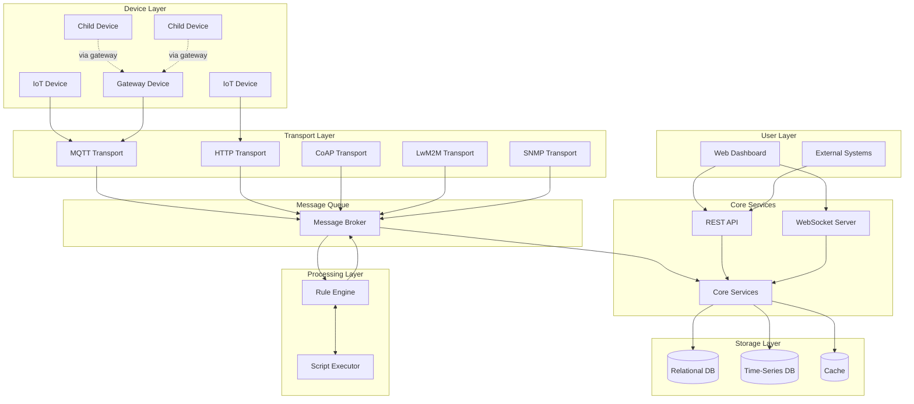
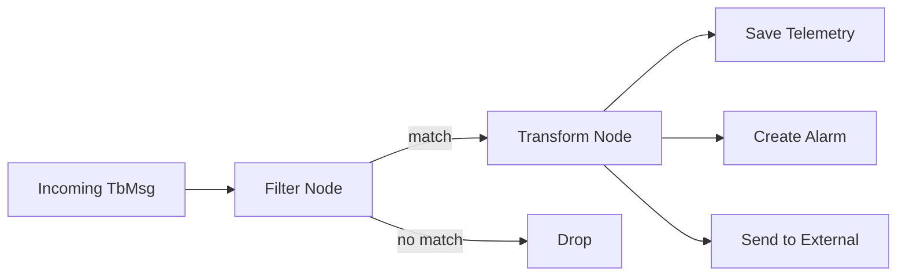
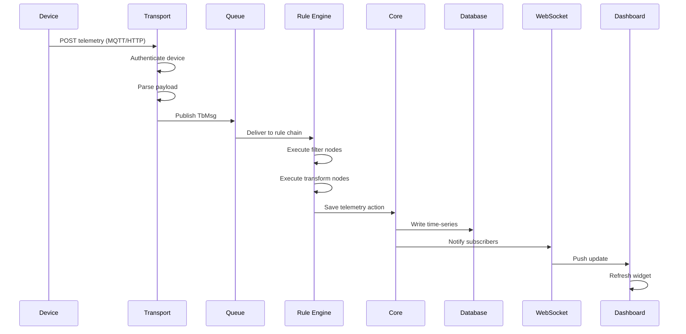
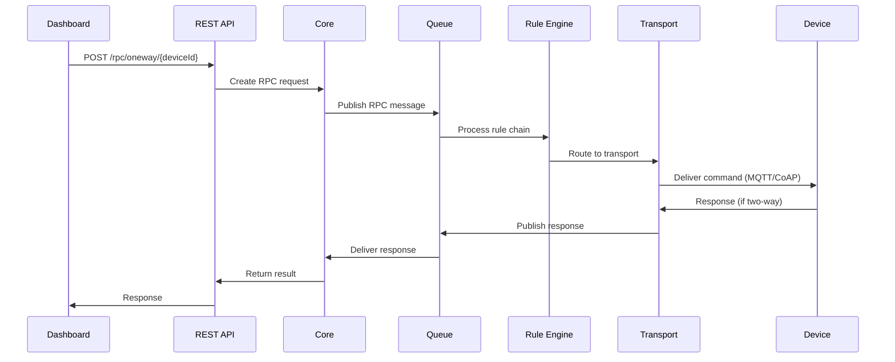
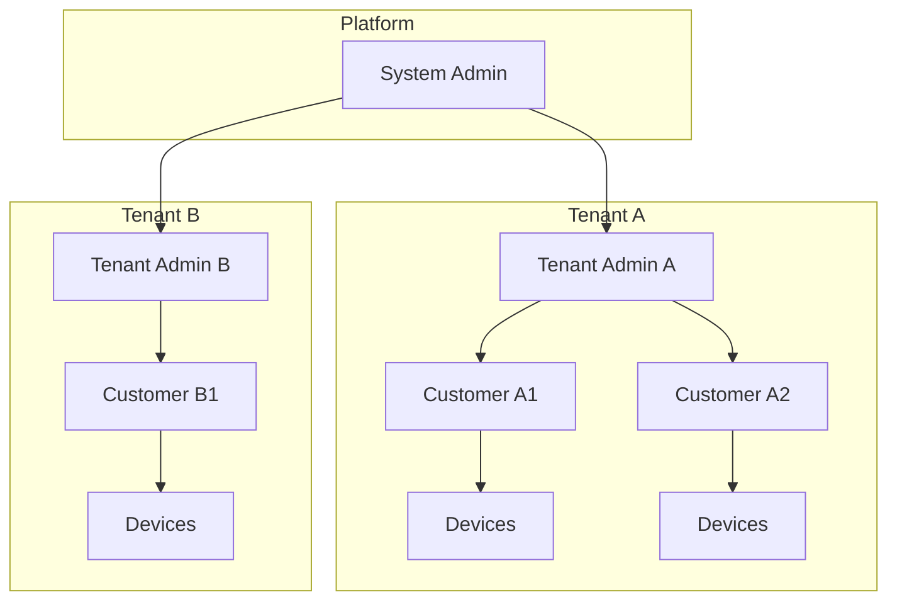
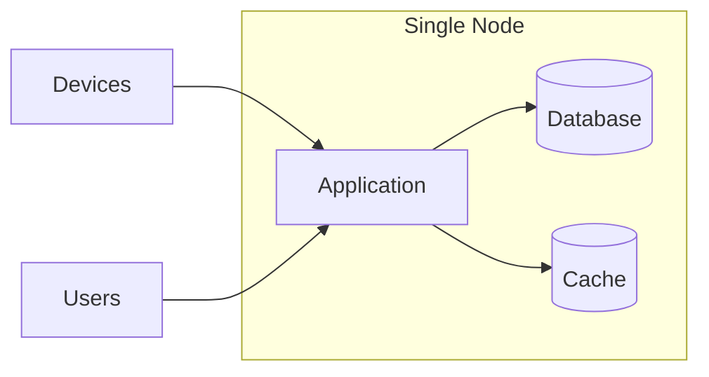
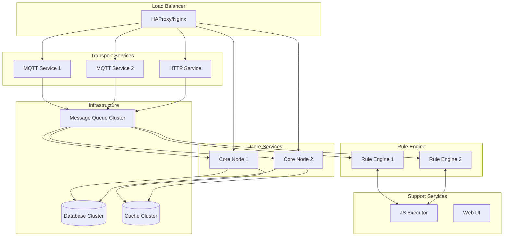

# System Overview

## Overview

ThingsBoard is a multi-tenant IoT platform that collects data from devices, processes it through configurable rule chains, stores it in databases, and presents it to users via dashboards. The platform handles millions of devices and messages through a scalable, distributed architecture.

## Technology Stack

| Component | Technology | Version |
|-----------|------------|---------|
| Language | Java | 17 |
| Framework | Spring Boot | 3.4.10 |
| Message Queue | Apache Kafka | 3.9.1 |
| Time-Series DB | Apache Cassandra | 4.17.0 |
| Relational DB | PostgreSQL | 15+ |
| Cache | Valkey/Redis | 7+ |
| RPC | gRPC | 1.76.0 |
| Serialization | Protocol Buffers | 3.25.5 |
| Networking | Netty | 4.1.128 |
| Frontend | Angular | 18+ |
| Service Discovery | Apache ZooKeeper | 3.9.3 |

## High-Level Architecture

## Component Responsibilities

### Transport Layer
Handles device connections and protocol translation.

| Component | Protocol | Responsibility |
|-----------|----------|----------------|
| MQTT Transport | MQTT 3.1.1/5.0 | Publish/subscribe messaging, session management |
| HTTP Transport | HTTP/HTTPS | REST-style device API, one-shot requests |
| CoAP Transport | CoAP | Constrained device communication over UDP |
| LwM2M Transport | LwM2M | Device management, object model mapping |
| SNMP Transport | SNMP v2c/v3 | Network device monitoring, polling/traps |

All transports perform:
1. **Authentication** - Validate device credentials
2. **Protocol Translation** - Convert to internal message format (TbMsg)
3. **Session Management** - Track connected devices
4. **Rate Limiting** - Protect against device flooding

### Message Queue
Decouples producers from consumers, enabling scalability.

- **Topics** organize messages by type and destination
- **Partitioning** distributes load across cluster nodes
- **Consumer Groups** enable parallel processing
- **Durability** prevents message loss during failures

### Rule Engine
Processes messages through configurable node chains.

Key behaviors:
- Each tenant has a default "root" rule chain
- Device profiles can override the rule chain
- Nodes process messages asynchronously
- Failed nodes can route to error handlers

### Core Services
Business logic and data management.

| Service | Responsibility |
|---------|----------------|
| Device Service | Device CRUD, credentials, state tracking |
| Telemetry Service | Time-series data storage and retrieval |
| Alarm Service | Alarm lifecycle (create, ack, clear) |
| Relation Service | Entity relationship management |
| Dashboard Service | Dashboard/widget configuration |
| User Service | Authentication, authorization |
| Notification Service | Email, SMS, push notifications |

### Storage Layer

**Relational Database** (PostgreSQL):
- Entity metadata (devices, assets, users)
- Configuration (rule chains, dashboards)
- Relationships and hierarchies
- Audit logs

**Time-Series Database** (PostgreSQL or Cassandra):
- Telemetry data with timestamps
- Optimized for range queries
- Configurable retention (TTL)

**Cache**:
- Session data
- Frequently accessed entities
- Rate limiting counters

### API Layer
External interfaces for users and integrations.

**REST API**:
- CRUD operations on all entities
- JWT authentication
- Pagination via PageLink
- Role-based access control

**WebSocket API**:
- Real-time telemetry subscriptions
- Alarm notifications
- Dashboard live updates

## Data Flow: Device Telemetry

## Data Flow: Server-to-Device RPC

## Multi-Tenancy Model

**Isolation guarantees:**
- Tenants cannot access each other's data
- Each tenant has separate:
  - Devices and assets
  - Rule chains
  - Dashboards
  - Users and customers
- Database queries always filter by tenant ID
- Actors process messages within tenant context

## Deployment Modes

### Monolithic
Single application instance with embedded services.

**Use case**: Development, small deployments (<10K devices)

### Microservices
Distributed services with message queue coordination.

**Use case**: Production, high availability, >100K devices

## Key Architectural Decisions

### Actor Model for Concurrency
Each device and rule chain has a dedicated actor that processes messages sequentially. This eliminates race conditions and enables millions of concurrent devices without complex locking.

### Message Queue for Decoupling
Asynchronous communication via message queue allows:
- Independent scaling of transports, core, and rule engine
- Fault isolation (failed component doesn't block others)
- Replay capability for recovery

### Configurable Rule Chains
Processing logic is defined as data (rule chains) rather than code. Users can modify behavior without deployments.

### Protocol-Agnostic Core
The core services work with a unified message format (TbMsg). Transport adapters handle protocol-specific details, making it easy to add new protocols.

## See Also

- [Actor System](../03-actor-system/README.md) - Concurrency model details
- [Rule Engine](../04-rule-engine/) - Rule chain architecture
- [Transport Layer](../05-transport-layer/) - Protocol implementations
- [Multi-Tenancy](./multi-tenancy.md) - Isolation details
