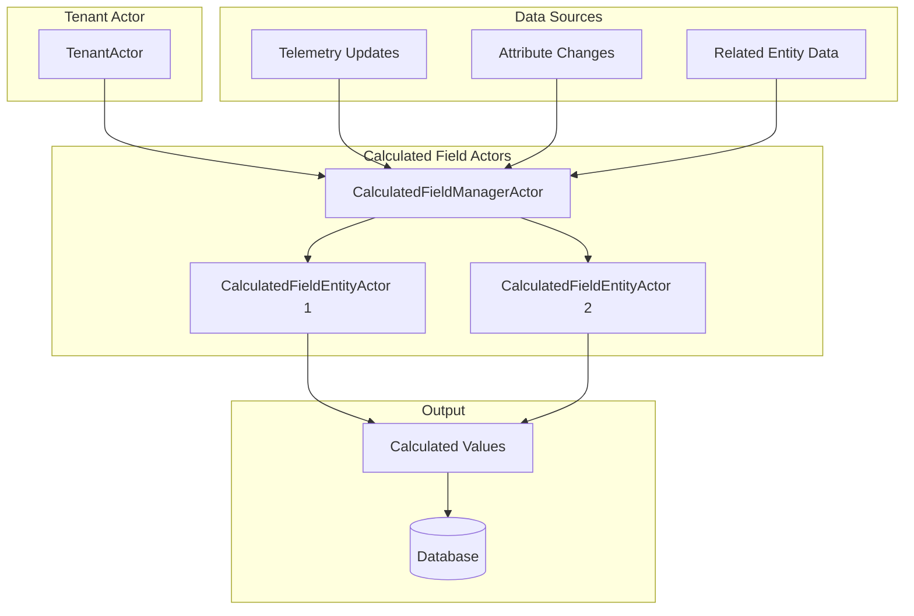
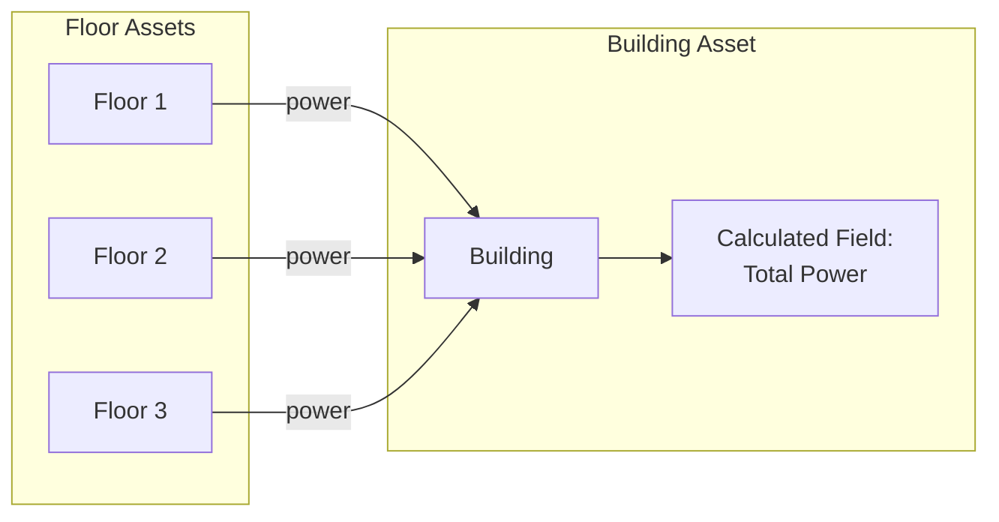
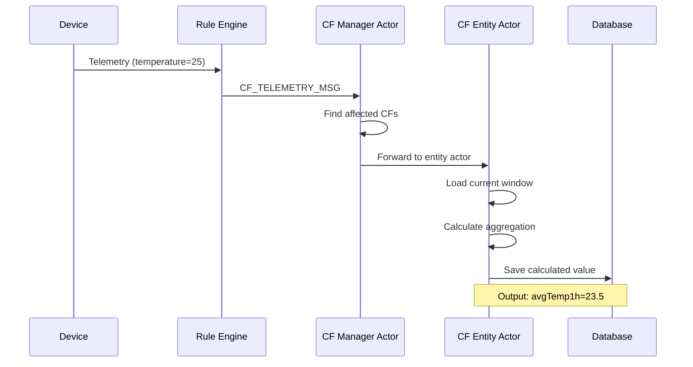

# Calculated Fields

## Overview

Calculated Fields are derived data values computed automatically from source telemetry, attributes, or other calculated fields. They enable real-time aggregation, transformation, and complex computations without custom rule chain logic. Introduced in ThingsBoard 4.x, calculated fields run via dedicated actors for efficient processing.

## Key Behaviors

1. **Automatic Computation**: Values are recalculated when source data changes.

2. **Actor-Based Processing**: Each entity with calculated fields has a dedicated actor for isolation.

3. **Multi-Source Aggregation**: Can aggregate data from multiple related entities.

4. **Expression-Based**: Uses TBEL (ThingsBoard Expression Language) for calculations.

5. **Geofencing Support**: Built-in support for location-based calculations.

## Architecture



## Calculated Field Types

### Single Entity Aggregation

Aggregates telemetry from a single entity over time:

| Aggregation | Description | Example |
|-------------|-------------|---------|
| AVG | Average value | Average temperature over 1 hour |
| SUM | Sum of values | Total energy consumption |
| MIN | Minimum value | Lowest temperature today |
| MAX | Maximum value | Peak power usage |
| COUNT | Number of samples | Readings per day |
| FIRST | First value in window | Opening price |
| LAST | Last value in window | Closing price |

### Multi-Entity Aggregation

Aggregates data from related entities:



### Geofencing Calculations

Location-based calculations with coordinates:

| Type | Description |
|------|-------------|
| EntityCoordinates | Geographic position from telemetry |
| Distance | Distance between entities |
| Geofence Entry/Exit | Boundary crossing detection |

## Configuration

### Calculated Field Entity

```json
{
  "id": {
    "entityType": "CALCULATED_FIELD",
    "id": "cf-uuid-here"
  },
  "tenantId": { "id": "tenant-uuid" },
  "entityId": { "entityType": "ASSET", "id": "asset-uuid" },
  "name": "avgTemperature",
  "type": "SINGLE_ENTITY_AGGREGATION",
  "configuration": {
    "aggregationType": "AVG",
    "sourceKey": "temperature",
    "windowType": "SLIDING",
    "windowSizeMs": 3600000
  },
  "outputKey": "avgTemp1h"
}
```

### Configuration Types

| Type | Config Class | Purpose |
|------|--------------|---------|
| SINGLE_ENTITY_AGGREGATION | EntityAggregationCalculatedFieldConfiguration | Time-window aggregation |
| MULTI_ENTITY_AGGREGATION | MultiEntityAggregationConfiguration | Cross-entity aggregation |
| GEOFENCING | GeofencingCalculatedFieldConfiguration | Location-based |
| EXPRESSION | ExpressionCalculatedFieldConfiguration | Custom TBEL expressions |

## Message Flow



## Actor Messages

### To Calculated Field System

| Message Type | Purpose |
|--------------|---------|
| CF_TELEMETRY_MSG | New telemetry data arrived |
| CF_LINKED_TELEMETRY_MSG | Related entity telemetry |
| CF_CACHE_INIT_MSG | Initialize calculation cache |
| CF_STATE_RESTORE_MSG | Restore state after restart |
| CF_ENTITY_ACTION_EVENT_MSG | Entity lifecycle events |
| CF_PARTITIONS_CHANGE_MSG | Cluster rebalancing |

### Internal Processing

| Message Type | Purpose |
|--------------|---------|
| CF_STATE_PARTITION_RESTORE_MSG | Partition state recovery |

## Window Types

### Sliding Window

Continuous time-based window:

```
|-------- 1 hour --------|
                    Now →|
[samples included in avg]
```

### Tumbling Window

Fixed non-overlapping windows:

```
|-- Hour 1 --|-- Hour 2 --|-- Hour 3 --|
[   batch 1  ][   batch 2 ][  batch 3  ]
```

### Count-Based Window

Fixed number of samples:

```
Last 100 samples regardless of time
```

## Expression Language (TBEL)

Calculated fields use TBEL for custom expressions:

```javascript
// Simple arithmetic
(temperature * 9/5) + 32

// Conditional logic
temperature > 30 ? 'hot' : 'normal'

// Aggregation reference
sum(power) * costPerKwh
```

## Performance Considerations

### Actor Lifecycle

- Actors created lazily on first calculation
- Idle actors stopped after timeout
- State persisted for recovery

### Caching

- Recent telemetry cached in actor state
- Window data cached for efficiency
- Cache invalidated on configuration change

### Partitioning

- Calculated fields partitioned across cluster
- Partition changes trigger state migration
- High-priority messages for lifecycle events

## Use Cases

### Energy Monitoring

```
Building → Total Power = SUM(Floor.power)
Floor → Efficiency = power / area
```

### Fleet Management

```
Vehicle → Distance Today = SUM(odometer delta)
Fleet → Total Distance = SUM(Vehicle.distanceToday)
```

### Environmental Monitoring

```
Sensor → Avg Temperature = AVG(temperature, 1 hour)
Zone → Max Temperature = MAX(Sensor.avgTemperature)
```

## See Also

- [Telemetry](./telemetry.md) - Source data for calculations
- [Attributes](./attributes.md) - Configuration data
- [Actor System](../../03-actor-system/README.md) - Actor-based processing
- [Rule Engine](../../04-rule-engine/README.md) - Integration with rules
