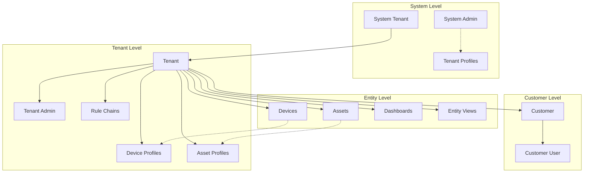
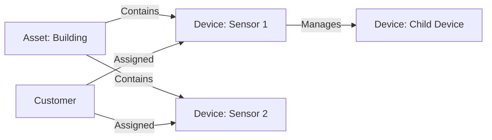

# Entity Types Overview

## Overview

ThingsBoard uses a comprehensive entity type system to model all platform objects. Each entity type has a unique identifier format, database representation, and associated behaviors. As of ThingsBoard 4.3.0, there are 27 distinct entity types.

## Entity Type Catalog

### Core Entities

| Entity Type | Proto # | Table Name | Description |
|-------------|---------|------------|-------------|
| TENANT | 1 | tenant | Multi-tenant organization |
| CUSTOMER | 2 | customer | Sub-organization within tenant |
| USER | 3 | tb_user | Platform user account |
| DEVICE | 6 | device | IoT device or sensor |
| ASSET | 5 | asset | Logical grouping or physical asset |
| DASHBOARD | 4 | dashboard | Visualization dashboard |
| ALARM | 7 | alarm | Alert or notification trigger |

### Rule Engine Entities

| Entity Type | Proto # | Table Name | Description |
|-------------|---------|------------|-------------|
| RULE_CHAIN | 11 | rule_chain | Message processing pipeline |
| RULE_NODE | 12 | rule_node | Individual processing step |

### Profile Entities

| Entity Type | Proto # | Table Name | Description |
|-------------|---------|------------|-------------|
| TENANT_PROFILE | 20 | tenant_profile | Tenant limits and configuration |
| DEVICE_PROFILE | 21 | device_profile | Device behavior template |
| ASSET_PROFILE | 22 | asset_profile | Asset behavior template |

### UI Entities

| Entity Type | Proto # | Table Name | Description |
|-------------|---------|------------|-------------|
| ENTITY_VIEW | 15 | entity_view | Filtered view of entity data |
| WIDGETS_BUNDLE | 16 | widgets_bundle | Collection of widget types |
| WIDGET_TYPE | 17 | widget_type | Reusable dashboard widget |

### System Entities

| Entity Type | Proto # | Table Name | Description |
|-------------|---------|------------|-------------|
| API_USAGE_STATE | 23 | api_usage_state | Usage tracking per tenant |
| TB_RESOURCE | 24 | resource | Uploaded files and resources |
| OTA_PACKAGE | 25 | ota_package | Firmware/software packages |
| QUEUE | 28 | queue | Message queue configuration |
| QUEUE_STATS | 34 | queue_stats | Queue statistics |
| ADMIN_SETTINGS | 42 | admin_settings | System configuration |

### Edge Computing

| Entity Type | Proto # | Table Name | Description |
|-------------|---------|------------|-------------|
| EDGE | 26 | edge | Edge gateway instance |
| RPC | 27 | rpc | Remote procedure call record |

### Notification System

| Entity Type | Proto # | Table Name | Description |
|-------------|---------|------------|-------------|
| NOTIFICATION_TARGET | 29 | notification_target | Notification recipients |
| NOTIFICATION_TEMPLATE | 30 | notification_template | Message template |
| NOTIFICATION_REQUEST | 31 | notification_request | Pending notification |
| NOTIFICATION | 32 | notification | Sent notification |
| NOTIFICATION_RULE | 33 | notification_rule | Automation rules |

### OAuth & Security

| Entity Type | Proto # | Table Name | Description |
|-------------|---------|------------|-------------|
| OAUTH2_CLIENT | 35 | oauth2_client | OAuth2 provider configuration |
| DOMAIN | 36 | domain | Custom domain mapping |
| API_KEY | 44 | api_key | API access credentials |

### Mobile Applications

| Entity Type | Proto # | Table Name | Description |
|-------------|---------|------------|-------------|
| MOBILE_APP | 37 | mobile_app | Mobile application config |
| MOBILE_APP_BUNDLE | 38 | mobile_app_bundle | Mobile app package |

### Advanced Features (v4.x)

| Entity Type | Proto # | Table Name | Description |
|-------------|---------|------------|-------------|
| CALCULATED_FIELD | 39 | calculated_field | Computed/derived values |
| JOB | 41 | job | Background job execution |
| AI_MODEL | 43 | ai_model | AI/ML model configuration |

## Entity Hierarchy



## Entity Identification

### UUID-Based IDs

All entities use UUIDs as primary identifiers:

```java
public interface EntityId {
    UUID getId();
    EntityType getEntityType();
}
```

### ID Structure

```json
{
  "entityType": "DEVICE",
  "id": "784f3940-2f04-11ec-8f2e-4d7a8c12df56"
}
```

### Factory Pattern

Entity IDs are created via factory:

```java
EntityIdFactory.getByTypeAndId(EntityType.DEVICE, uuid);
EntityIdFactory.getByTypeAndUuid("DEVICE", uuidString);
```

## Common Entity Interfaces

### HasTenantId

All tenant-scoped entities implement this interface:

```java
public interface HasTenantId {
    TenantId getTenantId();
}
```

### HasName

Entities with human-readable names:

```java
public interface HasName {
    String getName();
}
```

### HasVersion

Entities with optimistic locking:

```java
public interface HasVersion {
    Long getVersion();
}
```

### ExportableEntity

Entities that can be exported/imported:

```java
public interface ExportableEntity<I extends EntityId> {
    I getExternalId();
    void setExternalId(I externalId);
}
```

## Entity Relationships

Entities connect through the relation system:



### Relation Types

| Type | Direction | Description |
|------|-----------|-------------|
| Contains | FROM | Parent contains child |
| Manages | FROM | Gateway manages device |
| Assigned | TO | Customer assigned entity |

## Proto Number Mapping

Entity types have stable proto numbers for gRPC serialization:

```java
public static EntityType forProtoNumber(int protoNumber) {
    return BY_PROTO[protoNumber];
}
```

This enables efficient binary serialization in inter-service communication.

## See Also

- [Device Entity](./device.md) - Device-specific documentation
- [Multi-Tenancy](../../01-architecture/multi-tenancy.md) - Tenant isolation
- [Data Persistence](../../07-data-persistence/) - Storage details
