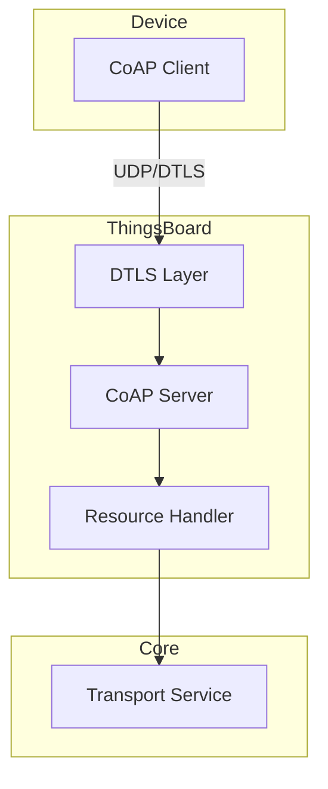
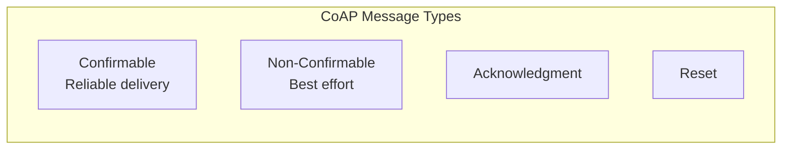
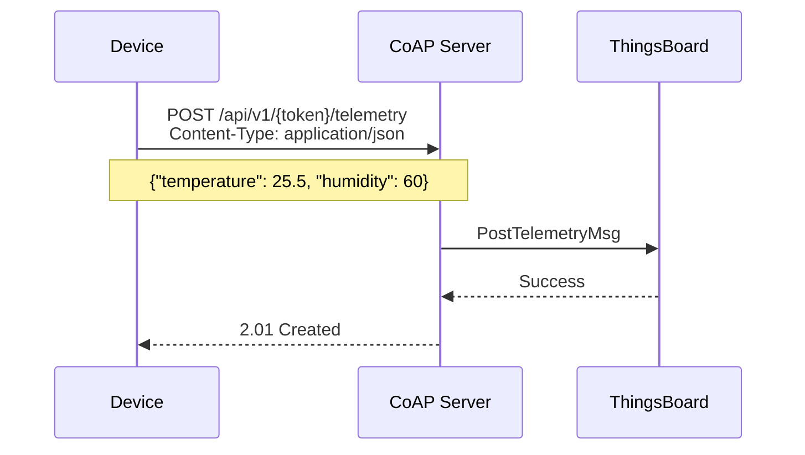
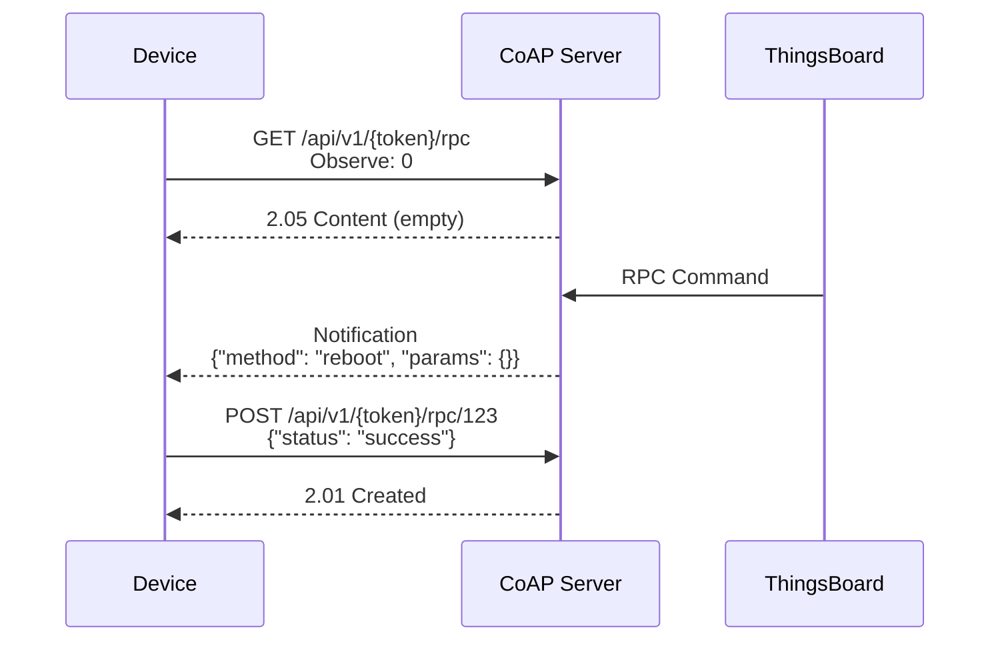
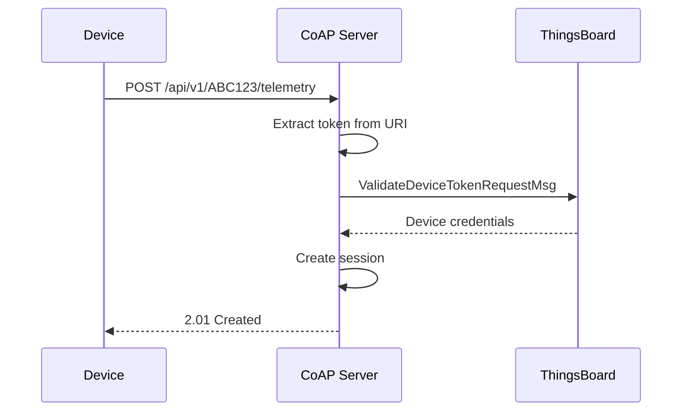
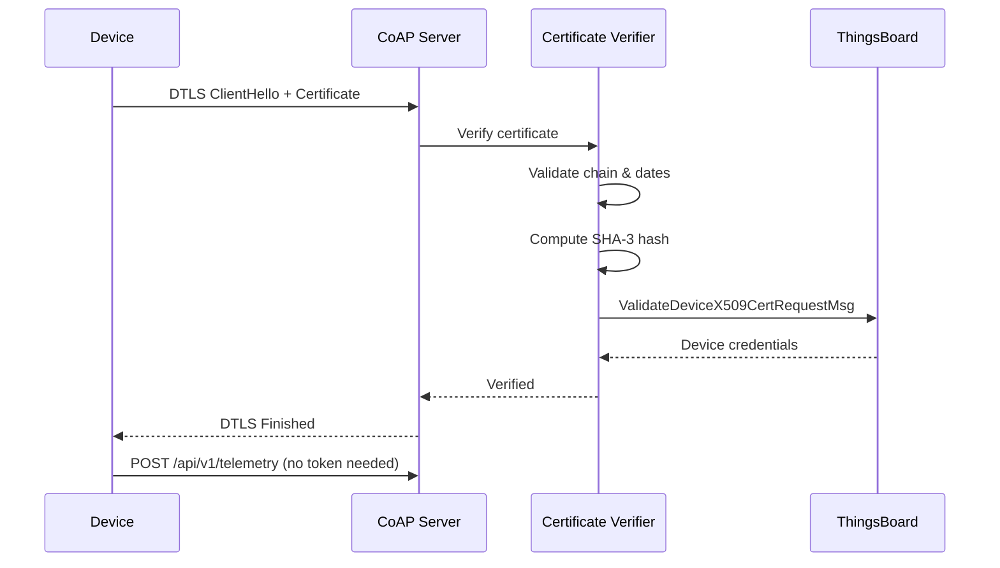
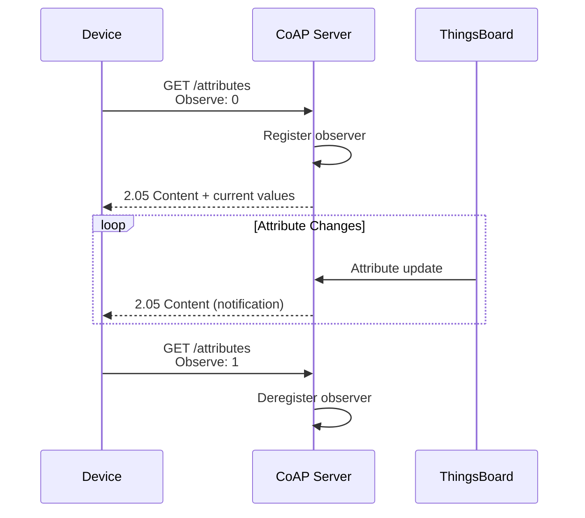
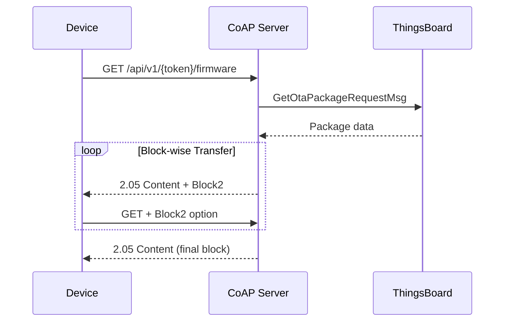
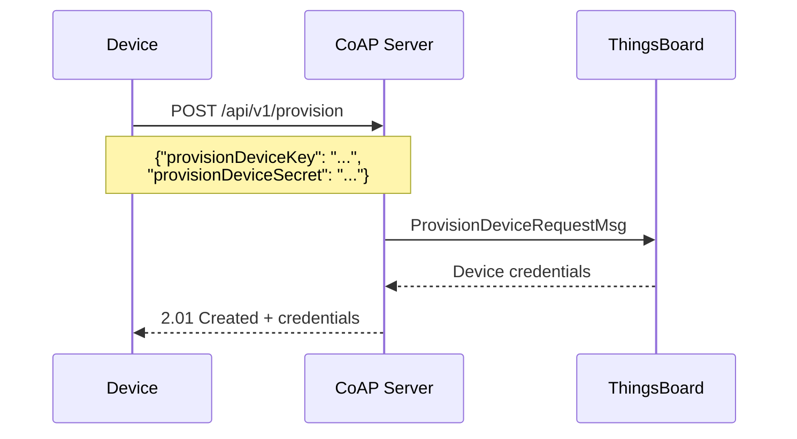
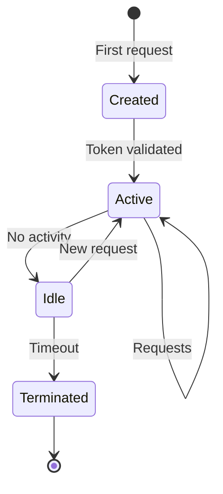

# CoAP Protocol

## Overview

CoAP (Constrained Application Protocol) is a lightweight, UDP-based protocol designed for resource-constrained IoT devices. ThingsBoard's CoAP transport provides a RESTful interface over UDP with optional DTLS security, making it ideal for battery-powered sensors and low-bandwidth networks. The protocol supports both confirmable (reliable) and non-confirmable (best-effort) message delivery.

## Key Behaviors

1. **UDP-Based Transport**: Lightweight protocol with minimal overhead for constrained devices.

2. **DTLS Security**: Optional encryption using X.509 certificates for secure communication.

3. **Observe Pattern**: Subscribe to resource changes for real-time attribute updates.

4. **Block-wise Transfer**: Support for large payload transfers (firmware updates).

5. **Access Token Authentication**: Simple token-based device authentication via URI path.

## Protocol Architecture

### Communication Model



### Message Types



| Type | Description | Use Case |
|------|-------------|----------|
| CON | Requires acknowledgment | Critical telemetry |
| NON | No acknowledgment | Frequent sensor data |
| ACK | Confirms CON receipt | Response to CON |
| RST | Indicates error | Protocol errors |

## Endpoints

### URI Structure

```
coap://host:5683/api/v1/{accessToken}/{resource}
coaps://host:5684/api/v1/{accessToken}/{resource}
```

### Available Resources

```mermaid
graph TB
    subgraph "CoAP Resources"
        TELEMETRY[/telemetry<br/>POST]
        ATTRIBUTES[/attributes<br/>GET, POST]
        RPC[/rpc<br/>GET, POST]
        CLAIM[/claim<br/>POST]
        PROVISION[/provision<br/>POST]
        FIRMWARE[/firmware<br/>GET]
        SOFTWARE[/software<br/>GET]
    end
```

| Resource | Method | Description |
|----------|--------|-------------|
| `/telemetry` | POST | Send time-series data |
| `/attributes` | GET | Retrieve attributes (supports Observe) |
| `/attributes` | POST | Update client attributes |
| `/rpc` | GET | Subscribe to RPC commands (Observe) |
| `/rpc/{requestId}` | POST | Respond to RPC command |
| `/claim` | POST | Claim device ownership |
| `/provision` | POST | Provision new device |
| `/firmware` | GET | Download firmware package |
| `/software` | GET | Download software package |

## Message Formats

### Telemetry Request



**Request Format:**
```json
{
  "temperature": 25.5,
  "humidity": 60,
  "timestamp": 1672531200000
}
```

**Response Codes:**
- `2.01 Created` - Success
- `4.00 Bad Request` - Invalid payload
- `4.01 Unauthorized` - Invalid token

### Attribute Operations

**GET Attributes:**
```
GET /api/v1/{token}/attributes?clientKeys=attr1,attr2&sharedKeys=config
```

**POST Attributes:**
```json
{
  "version": "1.0.5",
  "status": "active"
}
```

### RPC Commands



**RPC Request (from server):**
```json
{
  "method": "reboot",
  "params": {"delay": 10}
}
```

**RPC Response (from device):**
```json
{
  "status": "success"
}
```

## Authentication

### Access Token Authentication



Token is embedded in the URI path at position 3.

### DTLS Certificate Authentication



## Observe Pattern

### Attribute Subscription



### RPC Subscription

| Observe Option | Meaning |
|----------------|---------|
| 0 | Subscribe to updates |
| 1 | Unsubscribe |

## Configuration

### Server Configuration

| Setting | Default | Description |
|---------|---------|-------------|
| bind_address | 0.0.0.0 | Server bind address |
| bind_port | 5683 | CoAP port (no security) |
| dtls.enabled | false | Enable DTLS |
| dtls.bind_port | 5684 | CoAP+DTLS port |
| timeout | 10000 | Request timeout (ms) |
| piggyback_timeout | 500 | ACK piggyback timeout (ms) |

### DTLS Configuration

| Setting | Default | Description |
|---------|---------|-------------|
| retransmission_timeout | 9000 | DTLS retransmission (ms) |
| connection_id_length | 8 | Connection ID bytes |
| max_transmission_unit | 1024 | Max MTU |
| credentials.type | PEM | Certificate format |
| credentials.cert_file | coapserver.pem | Server certificate |
| credentials.key_file | coapserver_key.pem | Private key |

### Session Configuration

| Setting | Default | Description |
|---------|---------|-------------|
| inactivity_timeout | 600000 | Session idle timeout (ms) |
| report_timeout | 3000 | Activity report interval (ms) |
| dtls_session_inactivity_timeout | 86400000 | DTLS session timeout (24h) |

## OTA Updates

### Firmware Download



Block-wise transfer (RFC 7959) enables large file downloads.

## Device Provisioning

### Provisioning Flow



**Request:**
```json
{
  "provisionDeviceKey": "provision_key",
  "provisionDeviceSecret": "provision_secret"
}
```

## Response Codes

| Code | Name | Description |
|------|------|-------------|
| 2.01 | Created | Successful POST |
| 2.04 | Changed | Successful update |
| 2.05 | Content | Response with data |
| 4.00 | Bad Request | Invalid payload |
| 4.01 | Unauthorized | Invalid credentials |
| 4.04 | Not Found | Resource not found |
| 5.00 | Internal Error | Server error |
| 5.03 | Service Unavailable | Temporarily unavailable |

## Session Management

### Session Lifecycle



### Session State

| Property | Description |
|----------|-------------|
| Device credentials | Validated device info |
| Device profile | Feature configuration |
| Adaptor | JSON or Protobuf |
| Observe relations | Active subscriptions |
| RPC awaiting | Pending RPC responses |

## Content Formats

### Supported Formats

| Format | Content-Type | Use Case |
|--------|--------------|----------|
| JSON | application/json | Default, human-readable |
| Protobuf | application/octet-stream | Efficient binary |

### Protobuf Support

Device profiles can define custom Protobuf schemas for efficient serialization on constrained devices.

## Best Practices

### For Constrained Devices

| Practice | Benefit |
|----------|---------|
| Use NON messages | Reduced overhead |
| Enable Observe | Avoid polling |
| Use Protobuf | Smaller payloads |
| Implement DTLS | Security without TCP |

### For Reliable Delivery

| Practice | Benefit |
|----------|---------|
| Use CON messages | Guaranteed delivery |
| Handle RST | Detect connection issues |
| Implement retries | Handle packet loss |

## Troubleshooting

### Common Issues

| Issue | Cause | Solution |
|-------|-------|----------|
| 4.01 Unauthorized | Invalid token | Verify access token |
| No response | UDP blocked | Check firewall |
| DTLS failure | Certificate issue | Verify certificate chain |
| Observe not working | No Observe option | Include Observe: 0 |
| Large payload fails | No block-wise | Enable block transfer |

## See Also

- [Transport Contract](./transport-contract.md) - Common transport behaviors
- [MQTT Protocol](./mqtt.md) - Alternative TCP protocol
- [Device Entity](../02-core-concepts/entities/device.md) - Device configuration
- [Authentication](../06-api-layer/authentication.md) - Security overview
