# LwM2M Protocol

## Overview

LwM2M (Lightweight Machine-to-Machine) is an OMA (Open Mobile Alliance) standard protocol designed for IoT device management. Built on CoAP, it provides a standardized object model for device registration, configuration, monitoring, and firmware updates. ThingsBoard implements a full LwM2M server supporting versions 1.0-1.2 with comprehensive security modes and OTA capabilities.

## Key Behaviors

1. **Object-Based Model**: Standardized objects for device info, connectivity, firmware, and sensors.

2. **Registration Lifecycle**: Devices register, update registration, and deregister with the server.

3. **Observe Pattern**: Server subscribes to resource changes for real-time monitoring.

4. **Bootstrap Support**: Server-initiated or client-initiated credential provisioning.

5. **Multiple Security Modes**: PSK, RPK, X.509 certificates, and no-security options.

6. **OTA Updates**: Standardized firmware and software update mechanisms.

## Protocol Architecture

### LwM2M Architecture

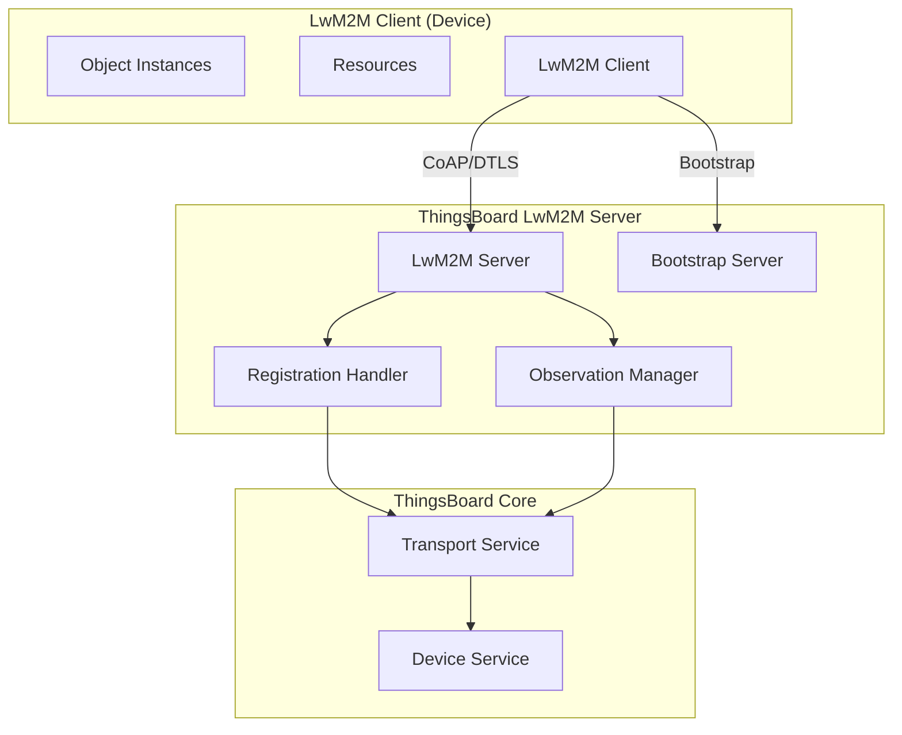

### Object Model Hierarchy

```mermaid
graph TB
    subgraph "LwM2M Path Structure"
        ROOT[/]
        OBJ[/{ObjectID}]
        INST[/{ObjectID}/{InstanceID}]
        RES[/{ObjectID}/{InstanceID}/{ResourceID}]
    end

    ROOT --> OBJ
    OBJ --> INST
    INST --> RES
```

**Path Format:** `/{ObjectID}/{InstanceID}/{ResourceID}`

Example: `/3/0/0` = Device Object, Instance 0, Manufacturer resource

## Standard Objects

### Core Objects

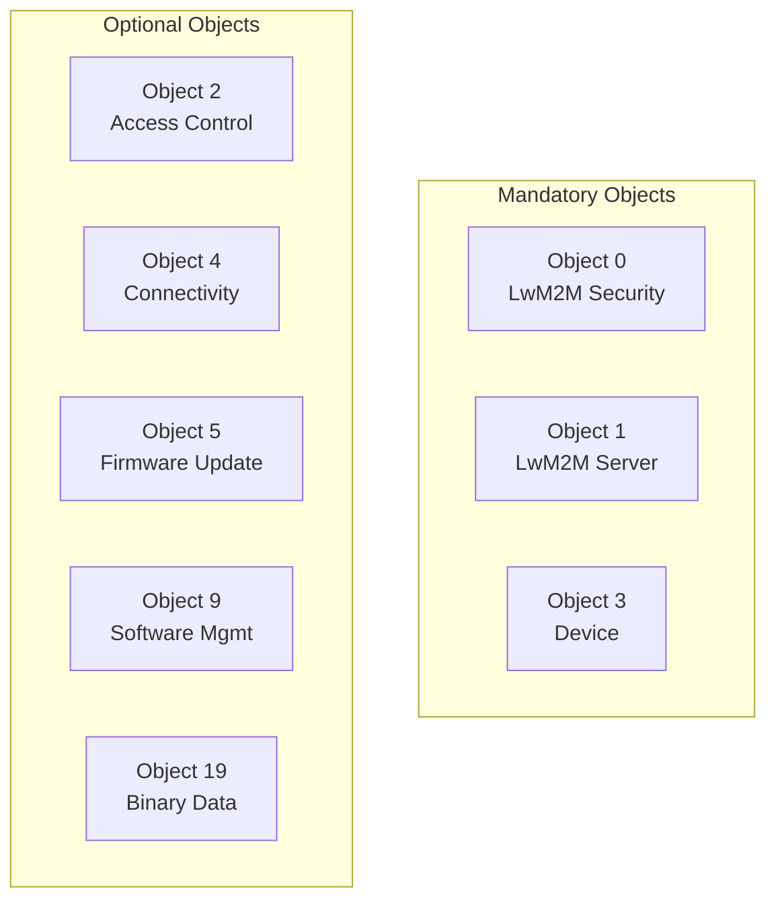

### Object 0: LwM2M Security

| Resource | ID | Description |
|----------|------|-------------|
| Server URI | 0 | Bootstrap/LwM2M server URI |
| Bootstrap Server | 1 | Is bootstrap server flag |
| Security Mode | 2 | PSK (0), RPK (1), Certificate (2), NoSec (3) |
| Public Key | 3 | Client public key or identity |
| Server Public Key | 4 | Server public key |
| Secret Key | 5 | PSK or private key |
| Short Server ID | 10 | Server identifier |

### Object 1: LwM2M Server

| Resource | ID | Description |
|----------|------|-------------|
| Short Server ID | 0 | Server identifier |
| Lifetime | 1 | Registration lifetime (seconds) |
| Default Min Period | 2 | Minimum observation period |
| Default Max Period | 3 | Maximum observation period |
| Disable Timeout | 5 | Disable timeout period |
| Binding | 7 | U (UDP), T (TCP), S (SMS) |

### Object 3: Device

| Resource | ID | Description |
|----------|------|-------------|
| Manufacturer | 0 | Device manufacturer |
| Model Number | 1 | Device model |
| Serial Number | 2 | Serial number |
| Firmware Version | 3 | Current firmware |
| Reboot | 4 | Execute to reboot |
| Factory Reset | 5 | Execute to reset |
| Battery Level | 9 | Battery percentage |
| Memory Total | 21 | Total memory |

### Object 5: Firmware Update

| Resource | ID | Description |
|----------|------|-------------|
| Package | 0 | Firmware binary |
| Package URI | 1 | Download URL |
| Update | 2 | Execute to install |
| State | 3 | Current state |
| Update Result | 5 | Last update result |

## Operations

### Supported Operations

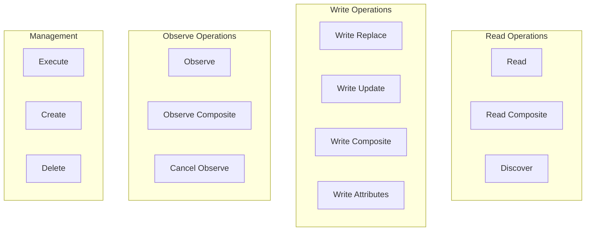

| Operation | Description |
|-----------|-------------|
| READ | Read single resource value |
| READ_COMPOSITE | Read multiple resources |
| DISCOVER | Get resource metadata |
| OBSERVE | Subscribe to changes |
| OBSERVE_COMPOSITE | Subscribe to multiple resources |
| EXECUTE | Execute resource function |
| WRITE_REPLACE | Replace entire resource |
| WRITE_UPDATE | Partial update |
| WRITE_COMPOSITE | Update multiple resources |
| CREATE | Create object instance |
| DELETE | Delete object instance |

### Operation Flow

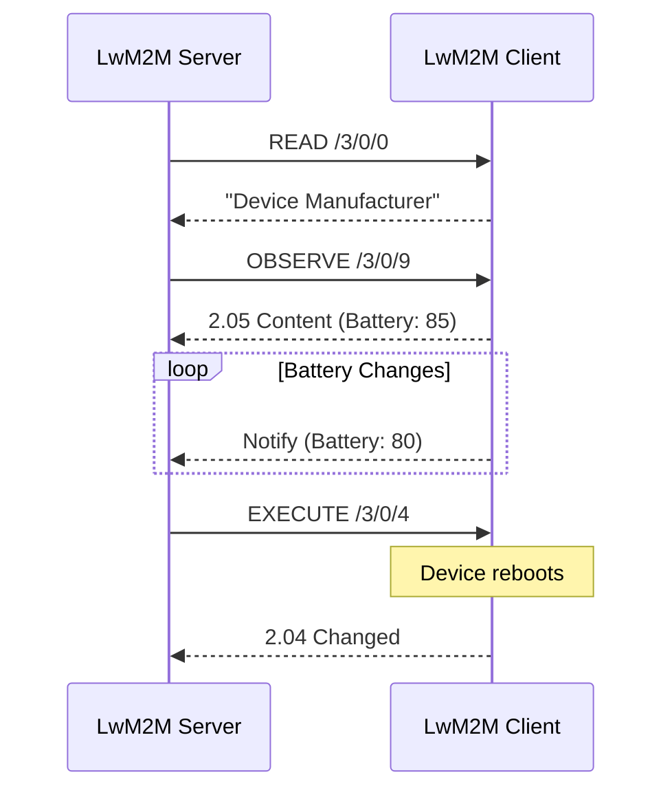

## Security Modes

### Security Options

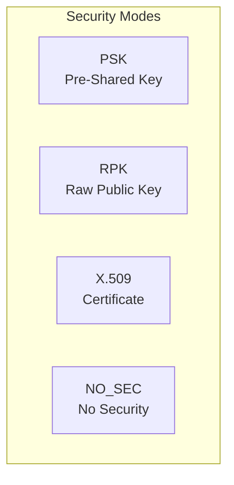

### PSK (Pre-Shared Key)

| Parameter | Description |
|-----------|-------------|
| Identity | PSK identity string |
| Key | Hex-encoded shared secret |

**Use Case:** Simple devices with pre-provisioned keys.

### RPK (Raw Public Key)

| Parameter | Description |
|-----------|-------------|
| Client Public Key | Base64-encoded public key |
| Client Private Key | Base64-encoded private key |
| Server Public Key | Base64-encoded server key |

**Use Case:** Certificate-less authentication for constrained devices.

### X.509 Certificate

| Parameter | Description |
|-----------|-------------|
| Client Certificate | PEM-encoded certificate |
| Client Private Key | Base64-encoded private key |
| Server Certificate | PEM-encoded server certificate |

**Use Case:** Enterprise deployments with PKI infrastructure.

### Security Configuration

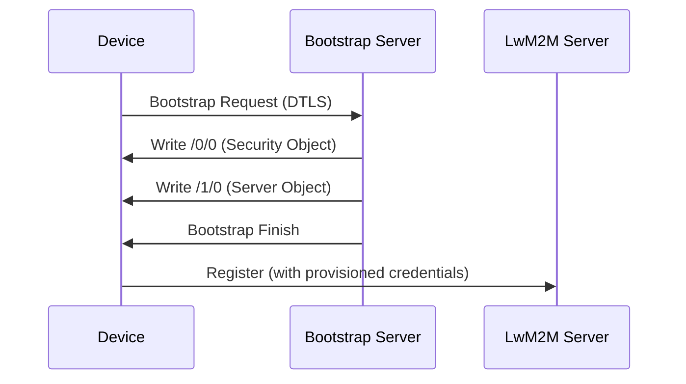

## Bootstrap

### Bootstrap Process

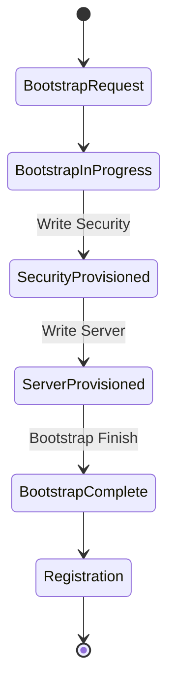

### Bootstrap Modes

| Mode | Description |
|------|-------------|
| Client-Initiated | Device requests bootstrap |
| Server-Initiated | Server triggers bootstrap |
| Bootstrap on Failure | Auto-bootstrap if registration fails |

### Bootstrap Configuration

| Setting | Description |
|---------|-------------|
| Bootstrap Server URI | coaps://host:5686 |
| Bootstrap Security Mode | PSK, RPK, X.509, NO_SEC |
| Client Hold Off Time | Delay before bootstrap |
| Bootstrap Account Timeout | Session timeout |

## Device Profiles

### LwM2M Profile Configuration

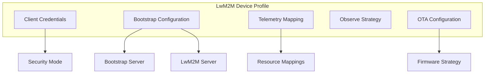

### Telemetry Mapping

| Setting | Description |
|---------|-------------|
| Key Name | ThingsBoard attribute/telemetry key |
| Resource Path | LwM2M resource path (e.g., /3/0/9) |
| Attribute Flag | Map as attribute |
| Telemetry Flag | Map as telemetry |

### Observe Strategies

| Strategy | Description |
|----------|-------------|
| SINGLE | One resource per observe request |
| COMPOSITE_ALL | All resources in one request |
| COMPOSITE_BY_OBJECT | Grouped by object ID |

## Firmware Updates

### Update Strategies

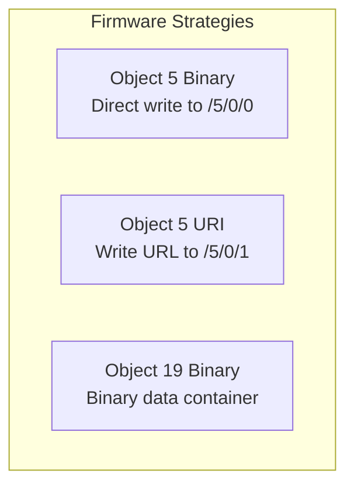

| Strategy | Description | Use Case |
|----------|-------------|----------|
| OBJ_5_BINARY | Write binary to Package resource | Small firmware |
| OBJ_5_TEMP_URL | Write download URL | Large firmware |
| OBJ_19_BINARY | Use Binary Data Container | Complex packages |

### Firmware State Machine

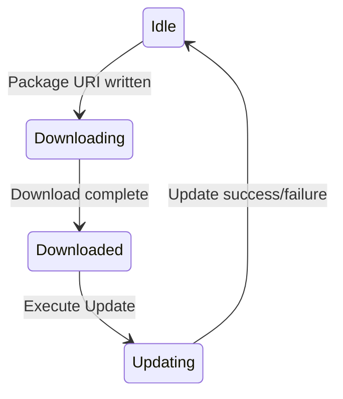

| State | Value | Description |
|-------|-------|-------------|
| Idle | 0 | Ready for update |
| Downloading | 1 | Download in progress |
| Downloaded | 2 | Ready to install |
| Updating | 3 | Installation in progress |

### Update Results

| Code | Result |
|------|--------|
| 0 | Initial state |
| 1 | Success |
| 2 | Insufficient storage |
| 3 | Out of memory |
| 4 | Connection lost |
| 5 | Integrity check failure |
| 6 | Unsupported package type |
| 7 | Invalid URI |
| 8 | Update failed |
| 9 | Unsupported protocol |
| 10 | Cancelled |

## Configuration

### Server Configuration

| Setting | Default | Description |
|---------|---------|-------------|
| bind_address | 0.0.0.0 | Server bind address |
| bind_port | 5685 | LwM2M server port |
| bootstrap_port | 5686 | Bootstrap server port |
| security_mode | DTLS | Default security |
| lifetime | 300 | Default registration lifetime |

### DTLS Configuration

| Setting | Description |
|---------|-------------|
| Server Certificate | Server's X.509 certificate |
| Server Private Key | Server's private key |
| Trust Store | Trusted CA certificates |
| Client Authentication | Required/Optional |

## Registration Lifecycle

### Registration Flow

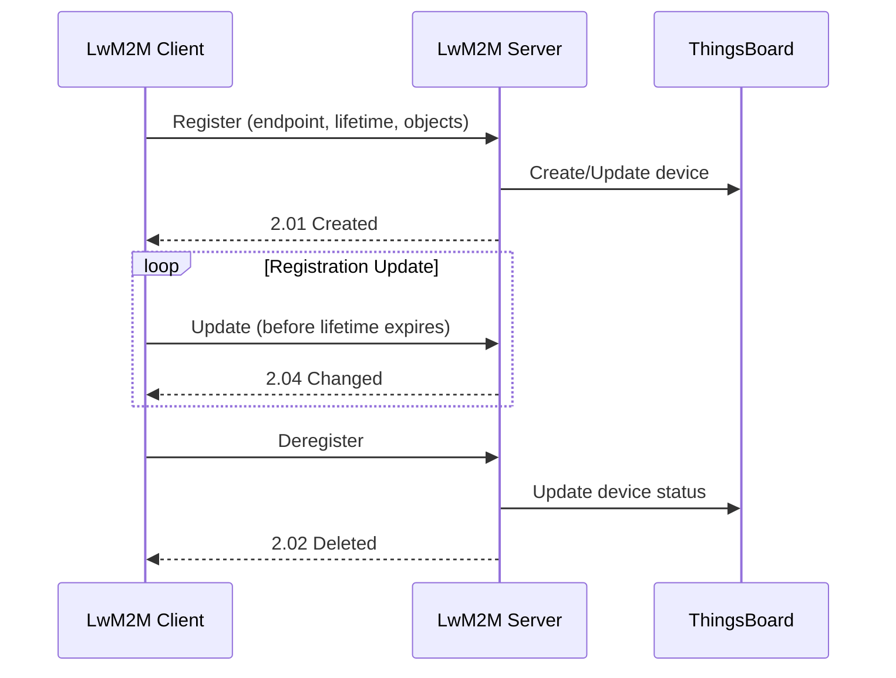

### Registration Parameters

| Parameter | Description |
|-----------|-------------|
| Endpoint Name | Unique client identifier |
| Lifetime | Registration validity (seconds) |
| LwM2M Version | Protocol version |
| Binding Mode | U (UDP), T (TCP) |
| Objects | Supported objects list |

## Best Practices

### Device Implementation

| Practice | Benefit |
|----------|---------|
| Use Observe | Efficient updates |
| Implement Object 3 | Device info standardized |
| Support firmware update | Enable OTA |
| Use DTLS | Secure communication |

### Server Configuration

| Practice | Benefit |
|----------|---------|
| Configure timeouts | Handle unreliable networks |
| Map resources to telemetry | Automatic data collection |
| Use composite observe | Reduce traffic |
| Enable bootstrap | Simplified provisioning |

## Troubleshooting

### Common Issues

| Issue | Cause | Solution |
|-------|-------|----------|
| Registration fails | Wrong credentials | Verify security config |
| Observe not working | Client doesn't support | Check object support |
| Firmware update fails | Wrong strategy | Match device capability |
| DTLS handshake fails | Certificate issue | Verify certificate chain |

### Debugging

| Tool | Purpose |
|------|---------|
| Wireshark | CoAP/DTLS packet analysis |
| Debug logging | Server-side troubleshooting |
| Device logs | Client-side issues |

## See Also

- [Transport Contract](./transport-contract.md) - Common transport behaviors
- [CoAP Protocol](./coap.md) - Underlying protocol
- [Device Entity](../02-core-concepts/entities/device.md) - Device configuration
- [Authentication](../06-api-layer/authentication.md) - Security overview
