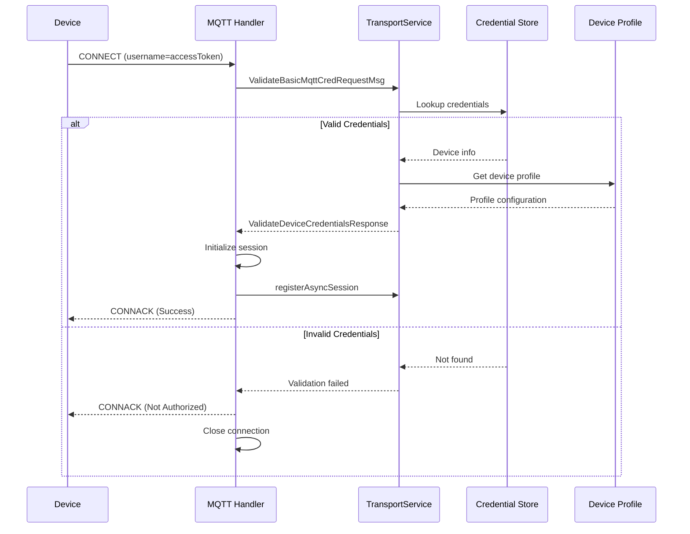
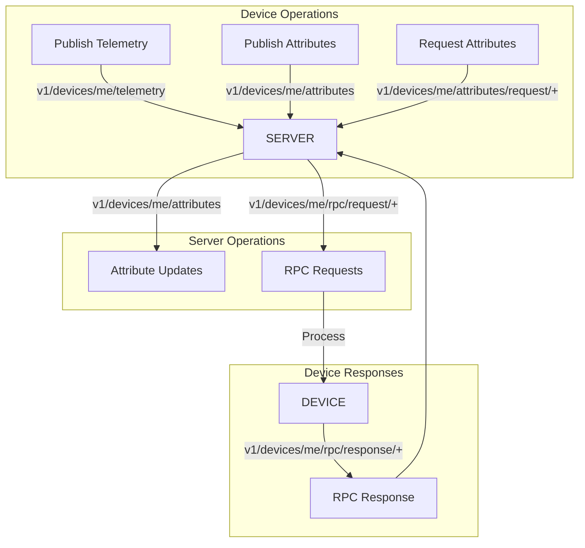
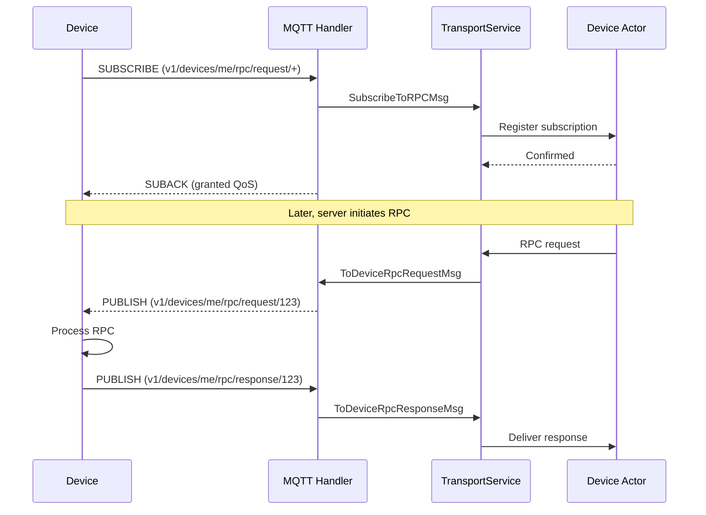
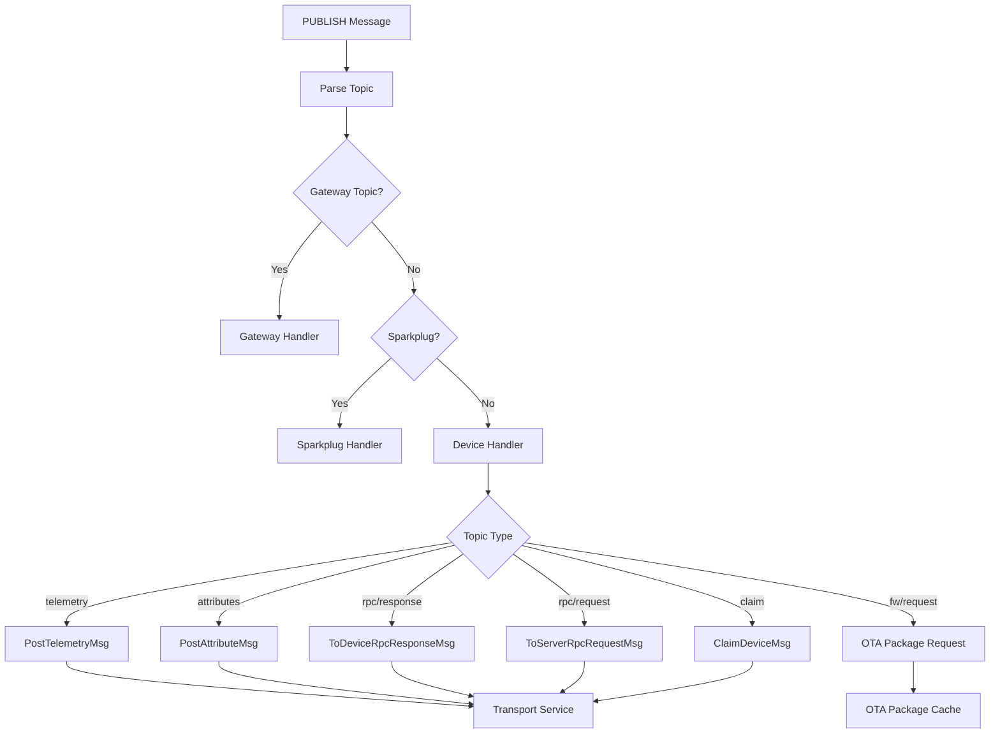
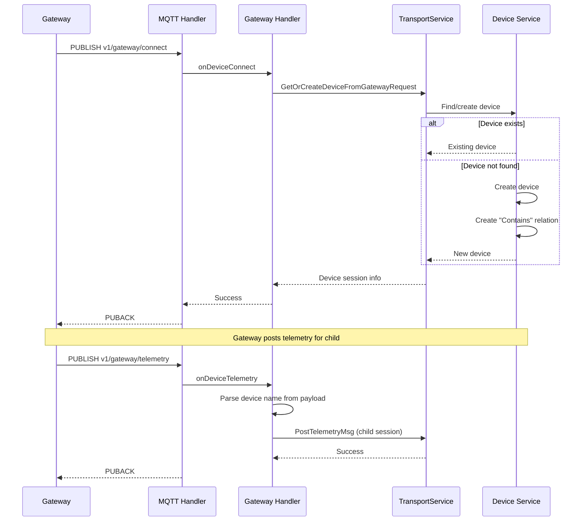
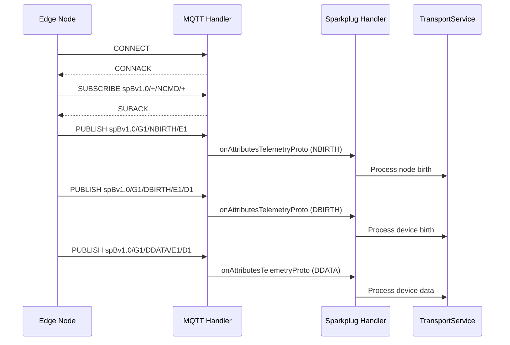
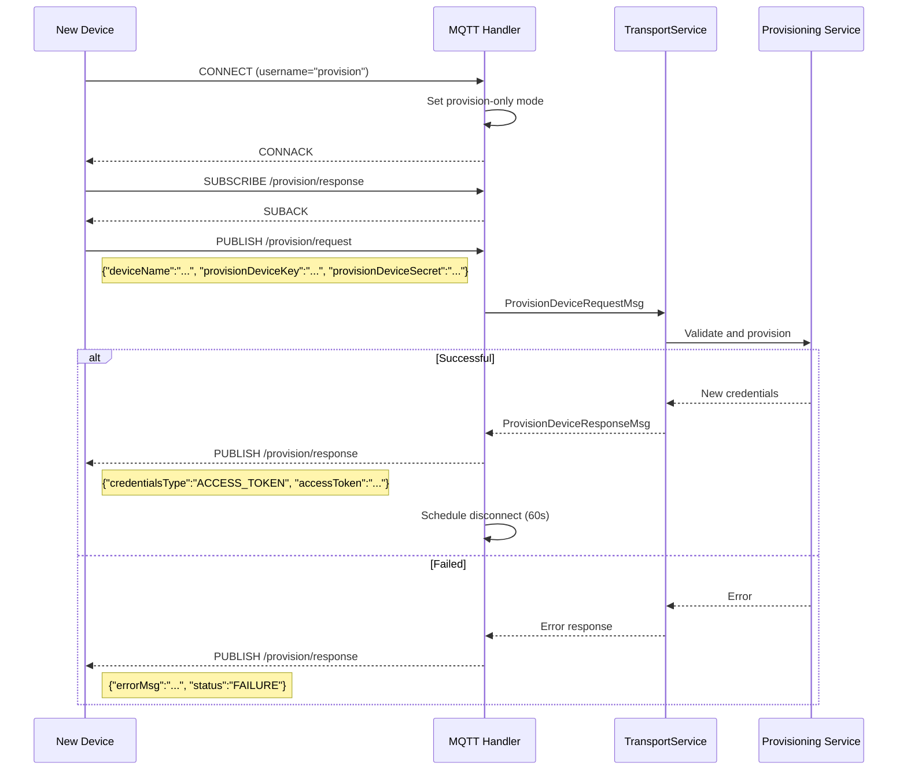
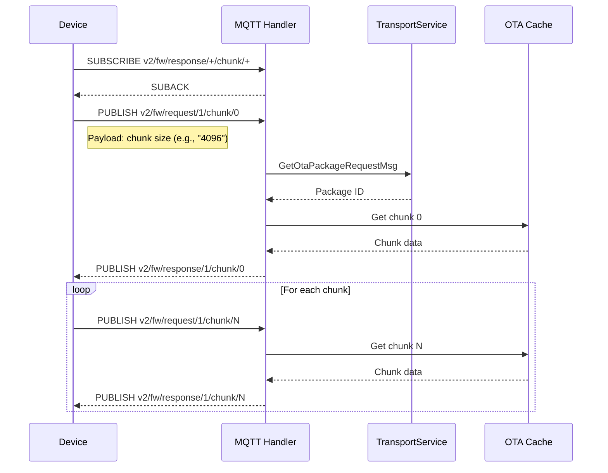
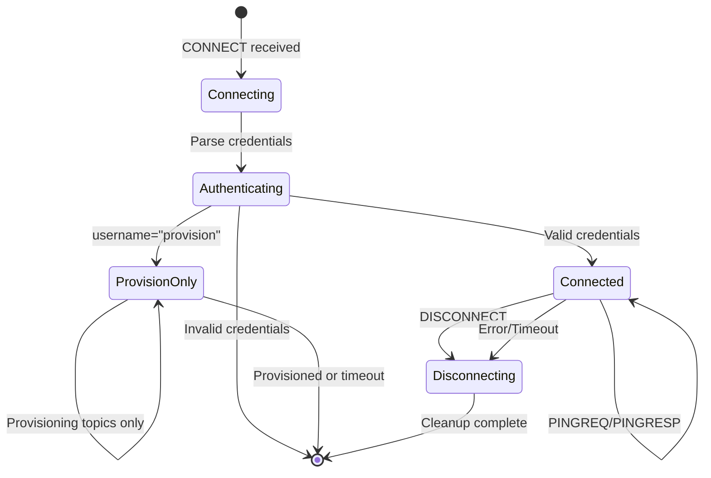

# MQTT Protocol

## Overview

MQTT (Message Queuing Telemetry Transport) is the primary device communication protocol in the platform. It provides a lightweight, publish/subscribe messaging model ideal for IoT devices with limited bandwidth and processing power. The platform supports MQTT 3.1.1 and MQTT 5.0, with features including QoS levels 0 and 1, persistent sessions, and bidirectional communication.

## Key Behaviors

1. **Access Token Authentication**: Devices authenticate using access tokens passed as the MQTT username.

2. **X.509 Certificate Authentication**: Devices can authenticate using client certificates for enhanced security.

3. **Two API Versions**: v1 topics use full paths (`v1/devices/me/telemetry`), v2 topics use short paths (`v2/t`) to reduce bandwidth.

4. **Multiple Payload Formats**: Supports JSON (default), Protocol Buffers, and device profile-specific formats.

5. **Bidirectional Communication**: Devices can publish data and subscribe to receive commands, attribute updates, and RPC requests.

6. **Gateway Support**: Gateway devices can manage multiple child devices through dedicated gateway topics.

7. **Sparkplug B Support**: Industrial IoT integration via the Sparkplug B specification.

## Connection Flow



## Authentication Methods

### Access Token Authentication

The simplest authentication method. Device passes access token as MQTT username.

| MQTT Field | Value |
|------------|-------|
| Username | Device access token |
| Password | (optional) |
| Client ID | Any unique identifier |

**Example:**
```
Username: A1B2C3D4E5F6G7H8
Password:
ClientId: myDevice001
```

### MQTT Basic Credentials

Uses both username and password for authentication.

| MQTT Field | Value |
|------------|-------|
| Username | Configured username |
| Password | Configured password |
| Client ID | Configured client ID |

### X.509 Certificate Authentication

Devices authenticate using TLS client certificates. The platform validates the certificate fingerprint against registered credentials.

**Requirements:**
- TLS connection required
- Client certificate must be configured in device credentials
- Certificate validity checked (can be disabled via configuration)

## Topic Structure

### v1 Device Topics

Standard topics for individual device communication.

| Operation | Topic | Direction | Payload |
|-----------|-------|-----------|---------|
| Post telemetry | `v1/devices/me/telemetry` | Device → Server | JSON telemetry |
| Post attributes | `v1/devices/me/attributes` | Device → Server | JSON attributes |
| Request attributes | `v1/devices/me/attributes/request/{requestId}` | Device → Server | `{"clientKeys":"k1,k2","sharedKeys":"k3"}` |
| Attribute response | `v1/devices/me/attributes/response/{requestId}` | Server → Device | JSON attributes |
| Subscribe to attributes | `v1/devices/me/attributes` | Server → Device | JSON shared attributes |
| Server RPC request | `v1/devices/me/rpc/request/{requestId}` | Server → Device | `{"method":"name","params":{}}` |
| Server RPC response | `v1/devices/me/rpc/response/{requestId}` | Device → Server | JSON response |
| Client RPC request | `v1/devices/me/rpc/request/{requestId}` | Device → Server | `{"method":"name","params":{}}` |
| Device claim | `v1/devices/me/claim` | Device → Server | `{"secretKey":"...", "durationMs":...}` |

### v2 Short Topics

Bandwidth-efficient topics for constrained devices.

| Operation | Topic | Format Variants |
|-----------|-------|-----------------|
| Post telemetry | `v2/t` | `v2/t/j` (JSON), `v2/t/p` (Protobuf) |
| Post attributes | `v2/a` | `v2/a/j` (JSON), `v2/a/p` (Protobuf) |
| Request attributes | `v2/a/req/{requestId}` | `v2/a/req/j/{id}`, `v2/a/req/p/{id}` |
| Attribute response | `v2/a/res/{requestId}` | `v2/a/res/j/{id}`, `v2/a/res/p/{id}` |
| RPC request (to device) | `v2/r/req/{requestId}` | `v2/r/req/j/{id}`, `v2/r/req/p/{id}` |
| RPC response (from device) | `v2/r/res/{requestId}` | `v2/r/res/j/{id}`, `v2/r/res/p/{id}` |

### Gateway Topics

Topics for gateway devices managing child devices.

| Operation | Topic | Payload |
|-----------|-------|---------|
| Child connect | `v1/gateway/connect` | `{"device":"name"}` |
| Child disconnect | `v1/gateway/disconnect` | `{"device":"name"}` |
| Telemetry (multi-device) | `v1/gateway/telemetry` | `{"Device A":[{...}], "Device B":[{...}]}` |
| Attributes (multi-device) | `v1/gateway/attributes` | `{"Device A":{...}, "Device B":{...}}` |
| Attribute request | `v1/gateway/attributes/request` | `{"id":1, "device":"name", "client":true, "keys":["k1"]}` |
| Attribute response | `v1/gateway/attributes/response` | Response payload |
| RPC response | `v1/gateway/rpc` | `{"device":"name", "id":1, "data":{}}` |
| Device claim | `v1/gateway/claim` | `{"Device A":{"secretKey":"..."}}` |

### Provisioning Topics

For automatic device registration.

| Operation | Topic |
|-----------|-------|
| Provision request | `/provision/request` |
| Provision response | `/provision/response` |

### OTA Update Topics

For firmware and software updates.

| Operation | Topic |
|-----------|-------|
| Firmware request | `v2/fw/request/{requestId}/chunk/{chunk}` |
| Firmware response | `v2/fw/response/{requestId}/chunk/{chunk}` |
| Firmware error | `v2/fw/error` |
| Software request | `v2/sw/request/{requestId}/chunk/{chunk}` |
| Software response | `v2/sw/response/{requestId}/chunk/{chunk}` |
| Software error | `v2/sw/error` |

## Topic Flow Diagram



## Payload Formats

### Telemetry Payload

**Simple format (server assigns timestamp):**
```json
{
  "temperature": 25.5,
  "humidity": 60,
  "status": "active"
}
```

**With explicit timestamp:**
```json
{
  "ts": 1634567890123,
  "values": {
    "temperature": 25.5,
    "humidity": 60
  }
}
```

**Multiple timestamps:**
```json
[
  {"ts": 1634567890000, "values": {"temperature": 25.5}},
  {"ts": 1634567891000, "values": {"temperature": 25.7}}
]
```

### Attributes Payload

**Client attributes:**
```json
{
  "firmware_version": "1.2.3",
  "ip_address": "192.168.1.100",
  "hardware_model": "ESP32"
}
```

### RPC Request Payload

**Server to device:**
```json
{
  "method": "setConfiguration",
  "params": {
    "interval": 30,
    "enabled": true
  }
}
```

**Device response:**
```json
{
  "result": "success"
}
```

### Gateway Telemetry Payload

```json
{
  "Sensor A": [
    {"ts": 1634567890123, "values": {"temperature": 25.5}}
  ],
  "Sensor B": [
    {"ts": 1634567890456, "values": {"humidity": 60}}
  ]
}
```

## QoS Support

| QoS Level | Name | Behavior | Supported |
|-----------|------|----------|-----------|
| 0 | At most once | Fire and forget, no acknowledgment | Yes |
| 1 | At least once | Guaranteed delivery with PUBACK | Yes |
| 2 | Exactly once | Guaranteed single delivery | No |

**QoS Selection:**
- The platform caps requested QoS at level 1
- Requested QoS 2 is downgraded to QoS 1
- Server-to-device messages use the subscribed QoS

## Subscription Flow



## Message Processing

### Publish Message Handling



### Gateway Message Flow



## Sparkplug B Support

The platform supports the Sparkplug B specification for industrial IoT integration.

### Sparkplug Topic Structure

```
spBv1.0/{group_id}/{message_type}/{edge_node_id}[/{device_id}]
```

| Message Type | Description |
|--------------|-------------|
| NBIRTH | Node birth certificate |
| NDEATH | Node death certificate |
| NDATA | Node data |
| NCMD | Node command |
| DBIRTH | Device birth certificate |
| DDEATH | Device death certificate |
| DDATA | Device data |
| DCMD | Device command |

### Sparkplug Flow



## Provisioning Flow



## OTA Updates Flow



## Session Management

### Session States



### Keep-Alive

- Devices send PINGREQ to maintain connection
- Server responds with PINGRESP
- Gateway devices trigger ping for all child device sessions
- Activity recorded on each interaction

## Error Handling

### MQTT 5.0 Reason Codes

| Code | Name | When |
|------|------|------|
| 0x00 | SUCCESS | Operation completed |
| 0x80 | UNSPECIFIED_ERROR | Generic failure |
| 0x83 | IMPLEMENTATION_SPECIFIC_ERROR | Internal error |
| 0x87 | NOT_AUTHORIZED | Authentication failed |
| 0x8F | TOPIC_FILTER_INVALID | Invalid subscription topic |
| 0x99 | PAYLOAD_FORMAT_INVALID | Malformed payload |

### Error Responses

| Error Type | MQTT 3.1.1 Behavior | MQTT 5.0 Behavior |
|------------|---------------------|-------------------|
| Invalid payload | Close connection | PUBACK with error code |
| Invalid topic | Close connection | PUBACK with TOPIC_NAME_INVALID |
| Rate limited | Close connection | PUBACK with error code |
| Auth failure | CONNACK refused | CONNACK with reason code |

## Configuration Options

### Device Profile Settings

| Setting | Description | Default |
|---------|-------------|---------|
| transportPayloadType | JSON or PROTOBUF | JSON |
| sendAckOnValidationException | Send PUBACK on errors | false |
| telemetryTopic | Custom telemetry topic pattern | Standard |
| attributesTopic | Custom attributes topic pattern | Standard |

### Transport Settings

| Setting | Description |
|---------|-------------|
| maxPayloadSize | Maximum payload size for OTA chunks |
| skipValidityCheckForClientCert | Skip X.509 validity check |

## Security Considerations

### TLS/SSL

- TLS encryption recommended for production
- Server certificate validation
- Optional client certificate authentication
- Certificate pinning support

### Access Control

- Devices can only access their own topics
- Gateway devices can access child device topics
- Provision-only sessions restricted to provisioning topics

### Rate Limiting

- Per-device message limits
- Per-tenant aggregate limits
- Transport-level global limits
- Exceeding limits results in connection termination

## Implementation Example

### Device Publishing Telemetry

```
# Connect
CONNECT
  Client ID: device001
  Username: A1B2C3D4E5F6

# Publish telemetry
PUBLISH
  Topic: v1/devices/me/telemetry
  QoS: 1
  Payload: {"temperature": 25.5, "humidity": 60}

# Receive acknowledgment
PUBACK
```

### Device Receiving RPC

```
# Subscribe to RPC requests
SUBSCRIBE
  Topic: v1/devices/me/rpc/request/+
  QoS: 1

# Receive SUBACK

# Later, receive RPC request
PUBLISH (from server)
  Topic: v1/devices/me/rpc/request/123
  Payload: {"method": "getValue", "params": {}}

# Send response
PUBLISH
  Topic: v1/devices/me/rpc/response/123
  Payload: {"value": 42}
```

## See Also

- [Transport Contract](./transport-contract.md) - Common transport interface
- [Device Entity](../02-core-concepts/entities/device.md) - Device authentication
- [Telemetry](../02-core-concepts/data-model/telemetry.md) - Data format
- [Attributes](../02-core-concepts/data-model/attributes.md) - Attribute handling
- [CoAP Protocol](./coap.md) - Alternative constrained protocol
- [HTTP Protocol](./http.md) - REST-based alternative
