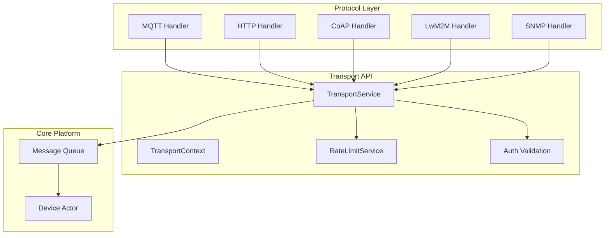
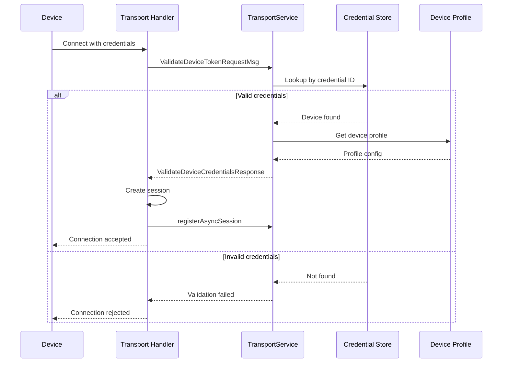
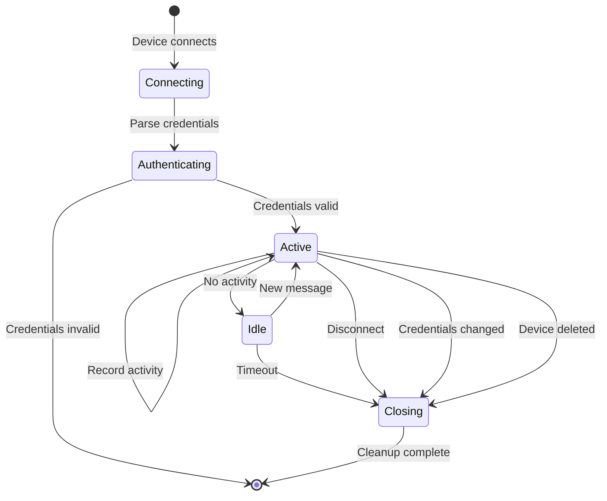
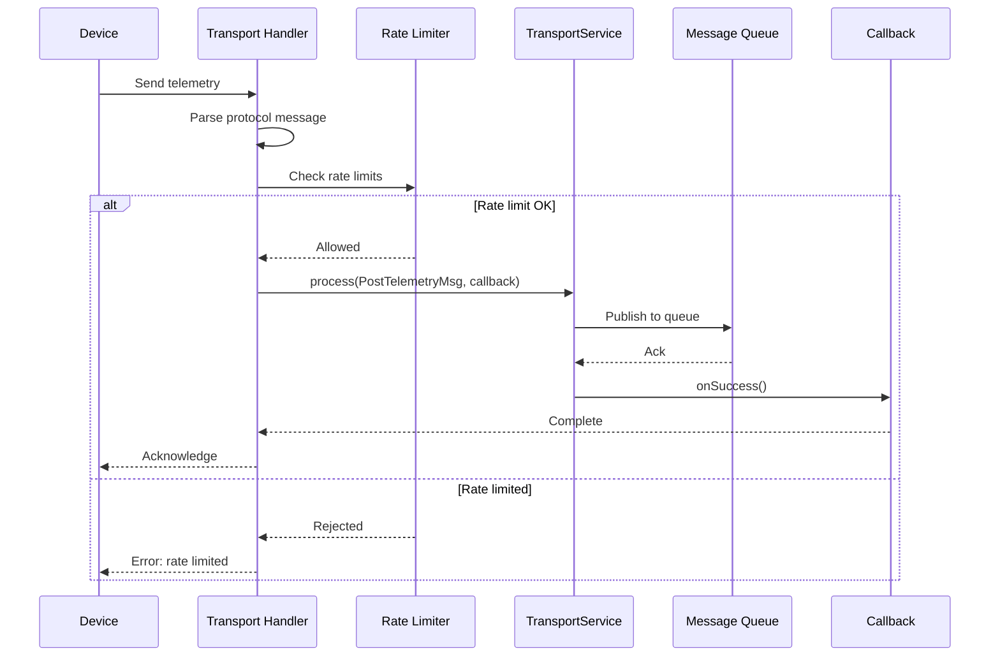
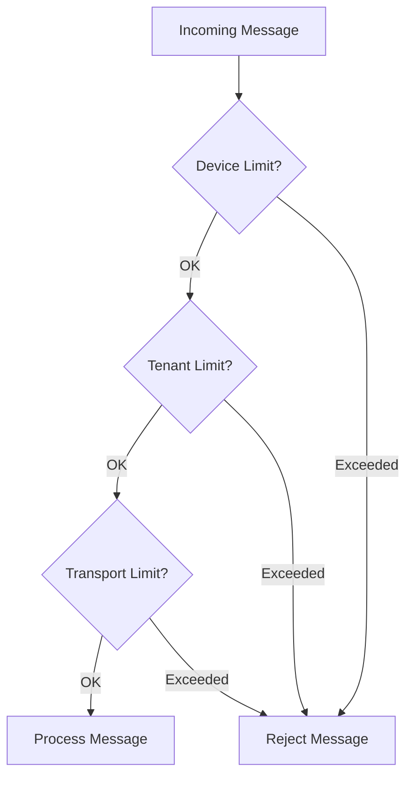
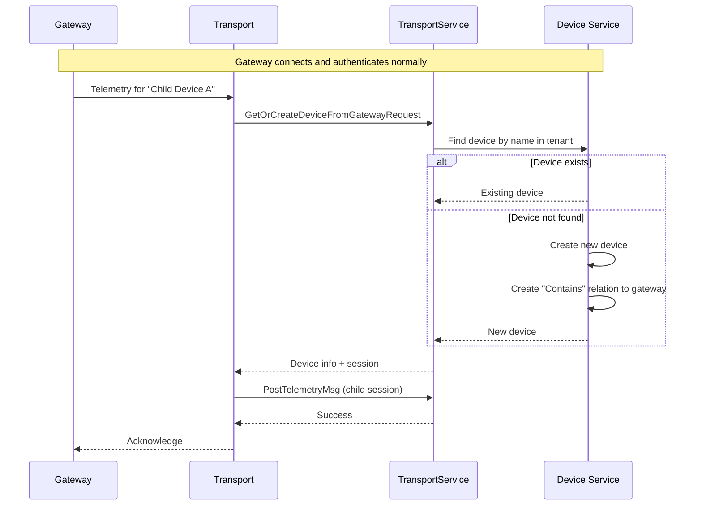
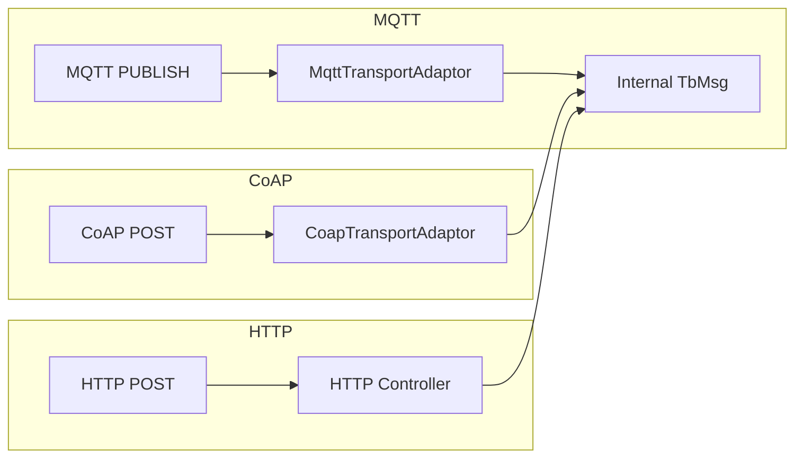

# Transport Layer Contract

## Overview

The transport layer is the entry point for device communication. It handles protocol-specific details (MQTT, CoAP, HTTP, LwM2M, SNMP) while exposing a unified interface to the rest of the platform. All transports authenticate devices, convert protocol messages to internal format, manage sessions, and enforce rate limits.

## Key Behaviors

1. **Protocol Translation**: Converts protocol-specific messages (MQTT PUBLISH, CoAP POST, HTTP request) into unified internal messages.

2. **Device Authentication**: Validates credentials before accepting data from devices.

3. **Session Management**: Tracks active device connections for bidirectional communication.

4. **Rate Limiting**: Enforces per-device and per-tenant limits to prevent abuse.

5. **Asynchronous Processing**: All operations are non-blocking with callback-based responses.

6. **Gateway Support**: Special handling for gateway devices that manage multiple child devices.

## Architecture

## Transport Types

| Type | Protocol | Description |
|------|----------|-------------|
| DEFAULT | HTTP, MQTT, CoAP | Standard handlers, no protocol-specific config |
| MQTT | MQTT 3.1.1/5.0 | Custom MQTT topics and payload formats |
| COAP | CoAP | Constrained device settings |
| LWM2M | LwM2M | Object model mapping for device management |
| SNMP | SNMP v2c/v3 | OID mapping for network devices |

## Core Interfaces

### TransportService

The central service that all protocol handlers use to communicate with the platform.

**Credential Validation:**

| Method | Credential Type | Description |
|--------|-----------------|-------------|
| process(ValidateDeviceTokenRequestMsg) | Access Token | Simple token authentication |
| process(ValidateBasicMqttCredRequestMsg) | MQTT Basic | Username/password for MQTT |
| process(ValidateDeviceX509CertRequestMsg) | X.509 Certificate | Certificate fingerprint validation |
| process(ValidateDeviceLwM2MCredentialsRequestMsg) | LwM2M | Protocol-specific credentials |

**Data Operations:**

| Method | Purpose |
|--------|---------|
| process(PostTelemetryMsg) | Device sends telemetry data |
| process(PostAttributeMsg) | Device sends client attributes |
| process(GetAttributeRequestMsg) | Device requests attributes |
| process(SubscribeToAttributeUpdatesMsg) | Subscribe to shared attribute changes |
| process(SubscribeToRPCMsg) | Subscribe to server-initiated RPC |
| process(ToDeviceRpcResponseMsg) | Device responds to RPC request |
| process(ToServerRpcRequestMsg) | Device initiates RPC to server |
| process(ClaimDeviceMsg) | Device claim request |

**Session Management:**

| Method | Purpose |
|--------|---------|
| registerAsyncSession | Register persistent connection (MQTT, CoAP observe) |
| registerSyncSession | Register request/response session (HTTP) |
| deregisterSession | Clean up session on disconnect |
| recordActivity | Update last activity timestamp |
| hasSession | Check if session is active |

**Device Operations:**

| Method | Purpose |
|--------|---------|
| process(GetOrCreateDeviceFromGatewayRequestMsg) | Gateway creates child device |
| process(ProvisionDeviceRequestMsg) | New device provisioning |
| getDevice | Retrieve device information |
| getDeviceCredentials | Retrieve device credentials |
| getEntityProfile | Get device/tenant profile |

### TransportContext

Base context providing shared services to all transport implementations.

| Component | Purpose |
|-----------|---------|
| transportService | Access to core transport operations |
| rateLimitService | Rate limiting enforcement |
| otaPackageDataCache | OTA firmware/software cache |
| transportResourceCache | Shared resource caching |
| executor | Thread pool for async operations |
| scheduler | Scheduled task execution |

### SessionMsgListener

Callback interface for receiving messages directed to a device session.

| Callback | When Triggered |
|----------|----------------|
| onGetAttributesResponse | Response to attribute request |
| onAttributeUpdate | Shared attribute changed |
| onToDeviceRpcRequest | Server sends RPC to device |
| onToServerRpcResponse | Response to device-initiated RPC |
| onRemoteSessionCloseCommand | Force disconnect from server |
| onDeviceDeleted | Device was deleted |
| onDeviceProfileUpdate | Device profile changed |
| onDeviceUpdate | Device metadata changed |
| onToTransportUpdateCredentials | Credentials were changed |

## Authentication Flow

## Session Lifecycle

### Session Info

Each session is identified by SessionInfoProto containing:

| Field | Type | Description |
|-------|------|-------------|
| sessionIdMSB | long | Session UUID (most significant bits) |
| sessionIdLSB | long | Session UUID (least significant bits) |
| tenantIdMSB | long | Tenant UUID |
| tenantIdLSB | long | Tenant UUID |
| deviceIdMSB | long | Device UUID |
| deviceIdLSB | long | Device UUID |
| deviceName | string | Device name |
| deviceType | string | Device type (from profile) |
| deviceProfileIdMSB | long | Profile UUID |
| deviceProfileIdLSB | long | Profile UUID |
| customerIdMSB | long | Customer UUID (optional) |
| customerIdLSB | long | Customer UUID (optional) |
| gwSessionIdMSB | long | Gateway session (if child device) |
| gwSessionIdLSB | long | Gateway session (if child device) |

## Message Processing Flow

## Rate Limiting

### Limit Types

| Limit | Scope | Description |
|-------|-------|-------------|
| Device Messages | Per device | Messages per time window |
| Device Data Points | Per device | Telemetry data points per window |
| Tenant Messages | Per tenant | Aggregate messages across all devices |
| Tenant Data Points | Per tenant | Aggregate data points |
| Transport Messages | Per transport | Global transport-level limit |

### Rate Limit Enforcement

## Gateway Protocol

Gateways require special handling for managing multiple child devices.

### Gateway Operations

| Operation | Purpose |
|-----------|---------|
| GetOrCreateDeviceFromGatewayRequest | Create/lookup child device by name |
| Connect event for child | Notify platform of child device activity |
| Disconnect event for child | Notify platform child went offline |
| Telemetry for child | Post data on behalf of child device |
| Attributes for child | Post attributes on behalf of child device |

### Gateway Flow

## Transport Device Info

After successful authentication, the transport receives device information:

| Field | Description |
|-------|-------------|
| tenantId | Owning tenant |
| customerId | Assigned customer (if any) |
| deviceProfileId | Device profile reference |
| deviceId | Unique device identifier |
| deviceName | Human-readable name |
| deviceType | Type from profile |
| powerMode | Power saving mode (for LwM2M) |
| gateway | True if gateway device |
| additionalInfo | Extra metadata |

## Protocol Implementation Checklist

When implementing a new transport protocol:

### Required Operations

- [ ] **Authentication**: Validate credentials via TransportService
- [ ] **Session Registration**: Register with registerAsyncSession or registerSyncSession
- [ ] **Session Deregistration**: Clean up on disconnect
- [ ] **Telemetry Processing**: Convert to PostTelemetryMsg
- [ ] **Attribute Processing**: Convert to PostAttributeMsg
- [ ] **Activity Recording**: Call recordActivity on messages

### Optional Operations

- [ ] **Attribute Subscription**: Implement SessionMsgListener.onAttributeUpdate
- [ ] **RPC Handling**: Implement onToDeviceRpcRequest
- [ ] **Server RPC**: Support ToServerRpcRequestMsg
- [ ] **OTA Updates**: Support firmware/software download
- [ ] **Gateway Mode**: Support child device management

### Error Handling

- [ ] **Invalid Credentials**: Return appropriate error code
- [ ] **Rate Limited**: Return throttling error
- [ ] **Malformed Message**: Log and reject
- [ ] **Internal Error**: Return server error, don't expose details

## Protocol-Specific Adaptors

Each protocol has an adaptor that converts protocol messages to internal format:

### Adaptor Responsibilities

1. **Parse payload** (JSON, Protobuf, CBOR)
2. **Extract timestamp** (or use server time)
3. **Validate structure** (required fields present)
4. **Convert to internal format** (TbMsg or Protobuf)
5. **Handle protocol errors** (malformed data)

## Error Codes

| Code | Meaning | Action |
|------|---------|--------|
| UNAUTHORIZED | Invalid credentials | Check token/certificate |
| RATE_LIMITED | Too many requests | Slow down, implement backoff |
| BAD_REQUEST | Malformed message | Fix payload format |
| NOT_FOUND | Device/resource missing | Verify device exists |
| INTERNAL_ERROR | Server failure | Retry with backoff |

## See Also

- [MQTT Protocol](./mqtt.md) - MQTT-specific implementation
- [Device Entity](../02-core-concepts/entities/device.md) - Device authentication
- [Telemetry](../02-core-concepts/data-model/telemetry.md) - Data format
- [Attributes](../02-core-concepts/data-model/attributes.md) - Attribute handling
- [Actor System](../03-actor-system/README.md) - Message processing
