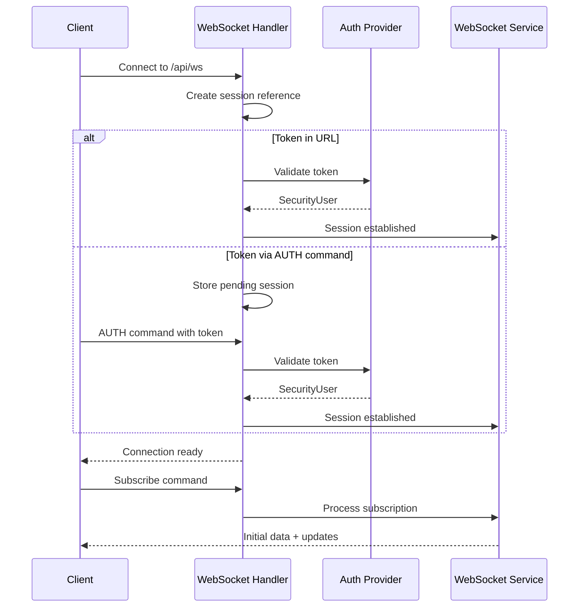
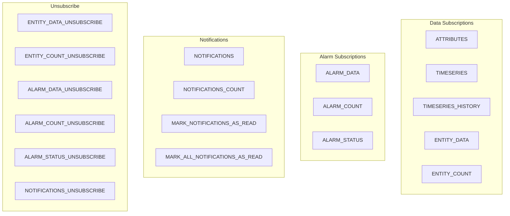
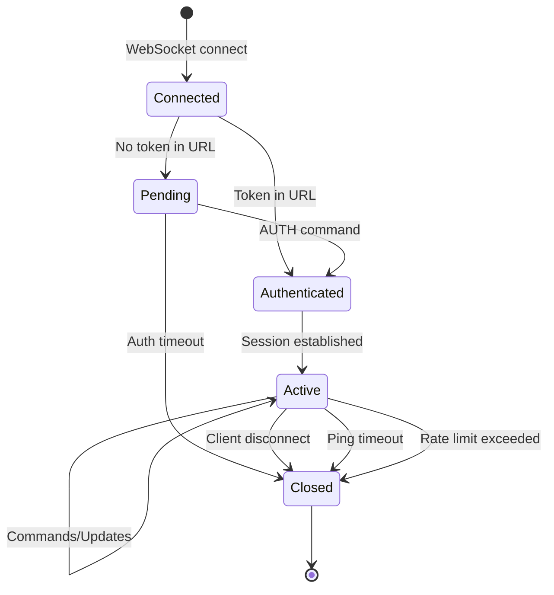
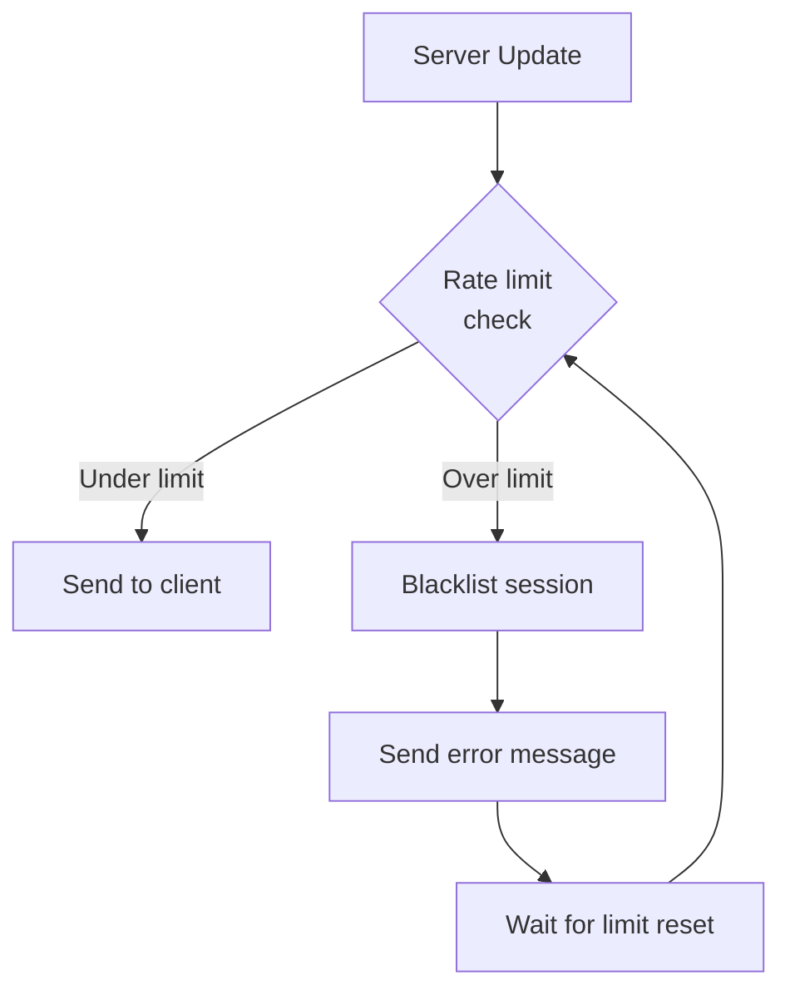

# WebSocket Overview

## Overview

ThingsBoard provides WebSocket connections for real-time data streaming between the server and web clients. WebSockets enable dashboards and applications to receive live updates for telemetry, attributes, alarms, entity data, and notifications without polling. The platform supports multiple subscription types, allowing clients to subscribe to specific entities and data keys with automatic updates when values change.

## Key Behaviors

1. **Bidirectional Communication**: Clients send commands and receive updates through the same connection.

2. **JWT Authentication**: Connections authenticate using JWT tokens, either via URL query parameter or AUTH command.

3. **Subscription-Based Updates**: Clients subscribe to specific data and receive incremental updates.

4. **Command/Response Pattern**: Each command has a unique cmdId, and responses reference that ID.

5. **Rate Limiting**: Per-session and per-tenant limits prevent resource exhaustion.

6. **Ping/Pong Keep-Alive**: Automatic ping mechanism detects stale connections.

## Connection Architecture

### Connection Flow



### WebSocket Endpoints

| Endpoint | Session Type | Description |
|----------|--------------|-------------|
| `/api/ws` | GENERAL | Primary endpoint (recommended) |
| `/api/ws/plugins/telemetry` | TELEMETRY | Legacy telemetry endpoint |
| `/api/ws/plugins/notifications` | NOTIFICATIONS | Legacy notifications endpoint |

### Connection URL Examples

**With Token in Query:**
```
wss://thingsboard.example.com/api/ws?token=eyJhbGciOiJIUzUxMiJ9...
```

**Without Token (authenticate via command):**
```
wss://thingsboard.example.com/api/ws
```

## Authentication

### URL Token Authentication

Pass the JWT access token as a query parameter:

```javascript
const ws = new WebSocket(`wss://server/api/ws?token=${accessToken}`);
```

### Command-Based Authentication

Send AUTH command as first message after connecting:

```json
{
  "authCmd": {
    "cmdId": 0,
    "token": "eyJhbGciOiJIUzUxMiJ9..."
  }
}
```

### Authentication Timeout

Connections without authentication are closed after a configurable timeout (default: 10 seconds).

## Message Format

### Command Wrapper Structure

All commands are wrapped in a container with optional auth and command array:

```json
{
  "authCmd": {
    "cmdId": 0,
    "token": "jwt-token"
  },
  "cmds": [
    {
      "type": "TIMESERIES",
      "cmdId": 1,
      "entityType": "DEVICE",
      "entityId": "device-uuid",
      "keys": "temperature,humidity"
    }
  ]
}
```

### Command Types



| Type | Description |
|------|-------------|
| AUTH | Authenticate the connection |
| ATTRIBUTES | Subscribe to attribute updates |
| TIMESERIES | Subscribe to telemetry updates |
| TIMESERIES_HISTORY | Fetch historical telemetry |
| ENTITY_DATA | Subscribe to entity data with queries |
| ENTITY_COUNT | Subscribe to entity count |
| ALARM_DATA | Subscribe to alarm updates |
| ALARM_COUNT | Subscribe to alarm count |
| ALARM_STATUS | Subscribe to alarm status changes |
| NOTIFICATIONS | Subscribe to user notifications |
| NOTIFICATIONS_COUNT | Subscribe to unread notification count |
| MARK_NOTIFICATIONS_AS_READ | Mark specific notifications read |
| MARK_ALL_NOTIFICATIONS_AS_READ | Mark all notifications read |
| *_UNSUBSCRIBE | Unsubscribe from specific subscription |

## Subscription Commands

### Timeseries Subscription (V1)

Subscribe to real-time telemetry updates for a specific entity.

**Request:**
```json
{
  "cmds": [{
    "type": "TIMESERIES",
    "cmdId": 1,
    "entityType": "DEVICE",
    "entityId": "784f394c-42b6-435a-983c-b7beff2784f9",
    "keys": "temperature,humidity",
    "startTs": 1704067200000,
    "timeWindow": 3600000,
    "interval": 60000,
    "limit": 100,
    "agg": "AVG"
  }]
}
```

**Parameters:**

| Parameter | Type | Required | Description |
|-----------|------|----------|-------------|
| cmdId | Integer | Yes | Unique command identifier |
| entityType | String | Yes | Entity type (DEVICE, ASSET, etc.) |
| entityId | String | Yes | Entity UUID |
| keys | String | Yes | Comma-separated telemetry keys |
| startTs | Long | No | Start timestamp (ms) |
| timeWindow | Long | No | Time window for historical data (ms) |
| interval | Long | No | Aggregation interval (ms) |
| limit | Integer | No | Maximum data points |
| agg | String | No | Aggregation (NONE, AVG, MIN, MAX, SUM, COUNT) |

### Attributes Subscription (V1)

Subscribe to attribute updates for a specific entity.

**Request:**
```json
{
  "cmds": [{
    "type": "ATTRIBUTES",
    "cmdId": 2,
    "entityType": "DEVICE",
    "entityId": "784f394c-42b6-435a-983c-b7beff2784f9",
    "keys": "active,lastActivityTime",
    "scope": "SERVER_SCOPE"
  }]
}
```

**Parameters:**

| Parameter | Type | Required | Description |
|-----------|------|----------|-------------|
| scope | String | No | Attribute scope (CLIENT_SCOPE, SERVER_SCOPE, SHARED_SCOPE) |

### Entity Data Subscription (V2)

Advanced subscription with entity queries for dashboards.

**Request:**
```json
{
  "cmds": [{
    "type": "ENTITY_DATA",
    "cmdId": 3,
    "query": {
      "entityFilter": {
        "type": "entityType",
        "entityType": "DEVICE"
      },
      "pageLink": {
        "page": 0,
        "pageSize": 10,
        "sortOrder": {
          "key": { "type": "ENTITY_FIELD", "key": "name" },
          "direction": "ASC"
        }
      },
      "entityFields": [
        { "type": "ENTITY_FIELD", "key": "name" },
        { "type": "ENTITY_FIELD", "key": "label" }
      ],
      "latestValues": [
        { "type": "TIME_SERIES", "key": "temperature" }
      ]
    },
    "latestCmd": {
      "keys": [
        { "type": "TIME_SERIES", "key": "temperature" }
      ]
    }
  }]
}
```

**Query Components:**

| Component | Description |
|-----------|-------------|
| entityFilter | Filter entities (by type, relations, etc.) |
| pageLink | Pagination and sorting |
| entityFields | Entity fields to include |
| latestValues | Latest telemetry/attributes to include |
| keyFilters | Filter by key values |

### Alarm Data Subscription

Subscribe to alarm updates with filters.

**Request:**
```json
{
  "cmds": [{
    "type": "ALARM_DATA",
    "cmdId": 4,
    "query": {
      "entityFilter": {
        "type": "entityType",
        "entityType": "DEVICE"
      },
      "alarmFields": [
        { "type": "ALARM_FIELD", "key": "type" },
        { "type": "ALARM_FIELD", "key": "severity" },
        { "type": "ALARM_FIELD", "key": "status" }
      ],
      "pageLink": {
        "page": 0,
        "pageSize": 10,
        "timeWindow": 86400000,
        "sortOrder": {
          "key": { "type": "ALARM_FIELD", "key": "createdTime" },
          "direction": "DESC"
        }
      },
      "searchPropagatedAlarms": true,
      "alarmStatusList": ["ACTIVE", "CLEARED"],
      "severityList": ["CRITICAL", "WARNING"]
    }
  }]
}
```

### Historical Data Request

Fetch historical telemetry without subscription.

**Request:**
```json
{
  "cmds": [{
    "type": "TIMESERIES_HISTORY",
    "cmdId": 5,
    "entityType": "DEVICE",
    "entityId": "784f394c-42b6-435a-983c-b7beff2784f9",
    "keys": "temperature",
    "startTs": 1704067200000,
    "endTs": 1704153600000,
    "interval": 3600000,
    "limit": 100,
    "agg": "AVG"
  }]
}
```

### Unsubscribe

Stop receiving updates for a subscription.

**Request:**
```json
{
  "cmds": [{
    "type": "ENTITY_DATA_UNSUBSCRIBE",
    "cmdId": 3
  }]
}
```

## Update Messages

### Telemetry Update

**Response:**
```json
{
  "subscriptionId": 1,
  "errorCode": 0,
  "data": {
    "temperature": [[1704067200000, "25.5"], [1704067260000, "25.7"]],
    "humidity": [[1704067200000, "60"], [1704067260000, "61"]]
  }
}
```

**Data Format:**
- Keys map to arrays of `[timestamp, value]` pairs
- Values are strings (client converts to appropriate type)

### Entity Data Update

**Response:**
```json
{
  "cmdId": 3,
  "cmdUpdateType": "ENTITY_DATA",
  "data": {
    "data": [
      {
        "entityId": { "entityType": "DEVICE", "id": "..." },
        "latest": {
          "TIME_SERIES": {
            "temperature": { "ts": 1704067200000, "value": "25.5" }
          }
        },
        "entityFields": {
          "name": { "ts": 0, "value": "Sensor 001" }
        }
      }
    ],
    "totalPages": 1,
    "totalElements": 1,
    "hasNext": false
  },
  "allowedEntities": 100
}
```

### Alarm Data Update

**Response:**
```json
{
  "cmdId": 4,
  "cmdUpdateType": "ALARM_DATA",
  "data": {
    "data": [
      {
        "id": { "entityType": "ALARM", "id": "alarm-uuid" },
        "type": "High Temperature",
        "severity": "WARNING",
        "status": "ACTIVE",
        "originator": { "entityType": "DEVICE", "id": "device-uuid" },
        "startTs": 1704067200000,
        "acknowledged": false,
        "cleared": false
      }
    ],
    "totalPages": 1,
    "totalElements": 1,
    "hasNext": false
  }
}
```

### Error Response

**Response:**
```json
{
  "subscriptionId": 1,
  "errorCode": 2,
  "errorMsg": "Bad request"
}
```

**Error Codes:**

| Code | Name | Description |
|------|------|-------------|
| 0 | NO_ERROR | Success |
| 1 | INTERNAL_ERROR | Server error |
| 2 | BAD_REQUEST | Invalid command format |
| 3 | UNAUTHORIZED | Permission denied |

## Session Management

### Session Lifecycle



### Session Limits

Limits are configured in tenant profile:

| Limit | Description |
|-------|-------------|
| maxWsSessionsPerTenant | Total sessions per tenant |
| maxWsSessionsPerCustomer | Sessions per customer |
| maxWsSessionsPerRegularUser | Sessions per user |
| maxWsSessionsPerPublicUser | Sessions per public user |
| wsMsgQueueLimitPerSession | Outbound message queue size |

### Ping/Pong Keep-Alive

The server sends WebSocket ping frames periodically:

| Setting | Default | Description |
|---------|---------|-------------|
| server.ws.ping_timeout | 30000ms | Time before connection considered stale |
| Ping frequency | ping_timeout / 3 | Ping sent every ~10 seconds |

If no pong response is received within the timeout, the connection is closed.

## Rate Limiting

### Update Limits

Rate limiting prevents clients from overwhelming the system:



When rate limited, clients receive:

```json
{
  "subscriptionId": 1,
  "errorCode": 429,
  "errorMsg": "Too many updates!"
}
```

### Configuration

| Setting | Default | Description |
|---------|---------|-------------|
| server.ws.send_timeout | 5000ms | Async send timeout |
| server.ws.max_queue_messages_per_session | 1000 | Max queued outbound messages |
| server.ws.auth_timeout_ms | 10000ms | Auth command timeout |

## Client Implementation

### JavaScript Example

```javascript
class ThingsboardWsClient {
  constructor(url, token) {
    this.url = url;
    this.token = token;
    this.cmdId = 0;
    this.subscriptions = new Map();
  }

  connect() {
    return new Promise((resolve, reject) => {
      this.ws = new WebSocket(`${this.url}?token=${this.token}`);

      this.ws.onopen = () => {
        console.log('WebSocket connected');
        resolve();
      };

      this.ws.onmessage = (event) => {
        const msg = JSON.parse(event.data);
        this.handleMessage(msg);
      };

      this.ws.onerror = (error) => reject(error);
      this.ws.onclose = () => console.log('WebSocket closed');
    });
  }

  subscribeTelemetry(entityType, entityId, keys, callback) {
    const cmdId = ++this.cmdId;
    this.subscriptions.set(cmdId, callback);

    const cmd = {
      cmds: [{
        type: 'TIMESERIES',
        cmdId: cmdId,
        entityType: entityType,
        entityId: entityId,
        keys: keys.join(',')
      }]
    };

    this.ws.send(JSON.stringify(cmd));
    return cmdId;
  }

  unsubscribe(cmdId) {
    const cmd = {
      cmds: [{
        type: 'ENTITY_DATA_UNSUBSCRIBE',
        cmdId: cmdId
      }]
    };
    this.ws.send(JSON.stringify(cmd));
    this.subscriptions.delete(cmdId);
  }

  handleMessage(msg) {
    const subId = msg.subscriptionId || msg.cmdId;
    const callback = this.subscriptions.get(subId);
    if (callback) {
      callback(msg);
    }
  }

  disconnect() {
    if (this.ws) {
      this.ws.close();
    }
  }
}

// Usage
const client = new ThingsboardWsClient('wss://server/api/ws', accessToken);
await client.connect();

client.subscribeTelemetry('DEVICE', deviceId, ['temperature', 'humidity'], (data) => {
  console.log('Telemetry update:', data);
});
```

### Handling Reconnection

```javascript
class ReconnectingWsClient extends ThingsboardWsClient {
  constructor(url, token, options = {}) {
    super(url, token);
    this.reconnectInterval = options.reconnectInterval || 5000;
    this.maxRetries = options.maxRetries || 10;
    this.retries = 0;
  }

  connect() {
    return super.connect().catch((error) => {
      console.error('Connection failed:', error);
      this.scheduleReconnect();
    });
  }

  scheduleReconnect() {
    if (this.retries < this.maxRetries) {
      this.retries++;
      console.log(`Reconnecting in ${this.reconnectInterval}ms (attempt ${this.retries})`);
      setTimeout(() => this.connect(), this.reconnectInterval);
    }
  }
}
```

## Best Practices

1. **Connection Management**: Reuse connections; don't create new WebSocket for each subscription.

2. **Subscription Cleanup**: Always unsubscribe when data is no longer needed.

3. **Error Handling**: Handle error responses and implement reconnection logic.

4. **Token Refresh**: Monitor token expiration and reconnect with new token before expiry.

5. **Batch Commands**: Send multiple subscriptions in a single message when possible.

6. **Data Filtering**: Subscribe only to needed keys to reduce bandwidth.

7. **Rate Limit Handling**: Implement backoff when receiving rate limit errors.

8. **Connection Health**: Monitor for ping timeouts and reconnect proactively.

## See Also

- [REST API Overview](./rest-api-overview.md) - General API patterns
- [Authentication](./authentication.md) - JWT authentication
- [Subscription Model](./subscription-model.md) - Detailed subscription patterns
- [Telemetry Data Model](../02-core-concepts/data-model/telemetry.md) - Telemetry structure
