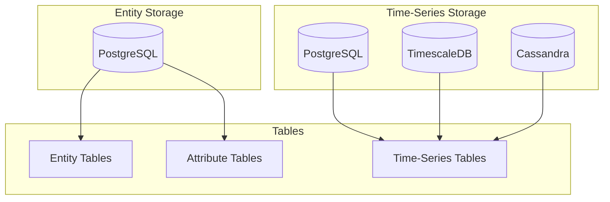
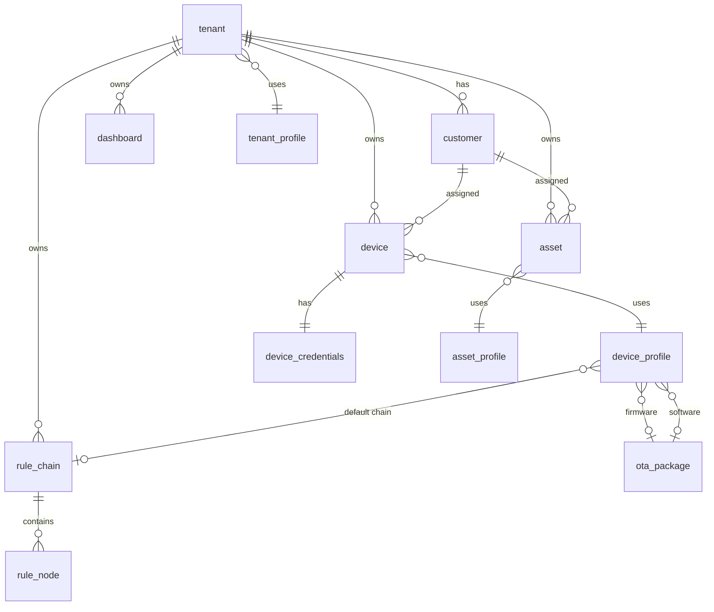

# Database Schema

## Overview

ThingsBoard uses a relational database (PostgreSQL) as its primary data store for entities, relationships, credentials, and configuration. Time-series data can be stored in PostgreSQL (using native tables or TimescaleDB extension) or optionally in Apache Cassandra for high-throughput scenarios. The schema follows a multi-tenant architecture where most entities are scoped to a tenant and use UUIDs as primary keys.

## Key Behaviors

1. **UUID Primary Keys**: All entities use UUID as the primary identifier, supporting distributed ID generation.

2. **Tenant Scoping**: Most tables include a `tenant_id` column for multi-tenant isolation.

3. **Optimistic Locking**: Version columns enable concurrent modification detection.

4. **JSON Storage**: Complex configurations are stored as JSONB columns in PostgreSQL.

5. **Dual Time-Series Storage**: Latest values and historical data are stored in separate tables for query optimization.

6. **Key Dictionary**: Time-series keys are mapped to integer IDs for storage efficiency.

## Schema Architecture

### Database Types



### Core Entity Relationships



## Core Tables

### tenant

Tenant is the top-level organizational unit.

| Column | Type | Nullable | Description |
|--------|------|----------|-------------|
| id | uuid | PK | Tenant UUID |
| created_time | bigint | No | Creation timestamp (ms) |
| title | varchar(255) | No | Tenant name |
| region | varchar(255) | Yes | Geographic region |
| tenant_profile_id | uuid | FK | Profile reference |
| country | varchar(255) | Yes | Contact country |
| state | varchar(255) | Yes | Contact state |
| city | varchar(255) | Yes | Contact city |
| address | varchar(255) | Yes | Contact address |
| address2 | varchar(255) | Yes | Additional address |
| zip | varchar(255) | Yes | ZIP code |
| phone | varchar(255) | Yes | Contact phone |
| email | varchar(255) | Yes | Contact email |
| additional_info | varchar | Yes | JSON metadata |
| version | bigint | No | Optimistic lock version |

### tenant_profile

Defines tenant quotas and features.

| Column | Type | Nullable | Description |
|--------|------|----------|-------------|
| id | uuid | PK | Profile UUID |
| created_time | bigint | No | Creation timestamp |
| name | varchar(255) | No | Profile name |
| description | varchar | Yes | Description |
| is_default | boolean | No | Default profile flag |
| isolated_tb_rule_engine | boolean | No | Isolated rule engine |
| profile_data | jsonb | No | Configuration (limits, features) |
| version | bigint | No | Optimistic lock version |

### customer

Customer within a tenant, can have assigned devices/assets.

| Column | Type | Nullable | Description |
|--------|------|----------|-------------|
| id | uuid | PK | Customer UUID |
| created_time | bigint | No | Creation timestamp |
| tenant_id | uuid | FK | Parent tenant |
| title | varchar(255) | No | Customer name |
| is_public | boolean | No | Public customer flag |
| country | varchar(255) | Yes | Contact country |
| state | varchar(255) | Yes | Contact state |
| city | varchar(255) | Yes | Contact city |
| address | varchar(255) | Yes | Contact address |
| address2 | varchar(255) | Yes | Additional address |
| zip | varchar(255) | Yes | ZIP code |
| phone | varchar(255) | Yes | Contact phone |
| email | varchar(255) | Yes | Contact email |
| additional_info | varchar | Yes | JSON metadata |
| version | bigint | No | Optimistic lock version |

### tb_user

Platform users (operators, not devices).

| Column | Type | Nullable | Description |
|--------|------|----------|-------------|
| id | uuid | PK | User UUID |
| created_time | bigint | No | Creation timestamp |
| tenant_id | uuid | FK | Owning tenant |
| customer_id | uuid | FK | Associated customer |
| authority | varchar(255) | No | Role (SYS_ADMIN, TENANT_ADMIN, CUSTOMER_USER) |
| email | varchar(255) | No | Login email (unique) |
| first_name | varchar(255) | Yes | First name |
| last_name | varchar(255) | Yes | Last name |
| additional_info | varchar | Yes | JSON metadata |

### user_credentials

User authentication data.

| Column | Type | Nullable | Description |
|--------|------|----------|-------------|
| id | uuid | PK | Credentials UUID |
| user_id | uuid | FK | User reference |
| enabled | boolean | No | Account enabled |
| password | varchar(255) | Yes | BCrypt hash |
| activate_token | varchar(255) | Yes | Activation token |
| activate_token_exp_time | bigint | Yes | Token expiration |
| reset_token | varchar(255) | Yes | Password reset token |
| reset_token_exp_time | bigint | Yes | Token expiration |
| last_login_ts | bigint | Yes | Last login timestamp |
| failed_login_attempts | int | Yes | Failed attempts count |

## Device Tables

### device

IoT devices connected to the platform.

| Column | Type | Nullable | Description |
|--------|------|----------|-------------|
| id | uuid | PK | Device UUID |
| created_time | bigint | No | Creation timestamp |
| tenant_id | uuid | FK | Owning tenant |
| customer_id | uuid | FK | Assigned customer |
| device_profile_id | uuid | FK | Device profile |
| name | varchar(255) | No | Unique name within tenant |
| type | varchar(255) | Yes | Device type (profile name) |
| label | varchar(255) | Yes | Display label |
| device_data | jsonb | Yes | Transport configuration |
| firmware_id | uuid | FK | Assigned firmware |
| software_id | uuid | FK | Assigned software |
| external_id | uuid | Yes | Import/export ID |
| additional_info | varchar | Yes | JSON metadata |
| version | bigint | No | Optimistic lock version |

**Indexes:**
- `device_tenant_id` on (tenant_id)
- `device_customer_id` on (customer_id)
- `device_name_unq_key` UNIQUE on (tenant_id, name)

### device_profile

Device configuration templates.

| Column | Type | Nullable | Description |
|--------|------|----------|-------------|
| id | uuid | PK | Profile UUID |
| created_time | bigint | No | Creation timestamp |
| tenant_id | uuid | FK | Owning tenant |
| name | varchar(255) | No | Profile name |
| type | varchar(255) | No | Device type |
| image | varchar | Yes | Profile image |
| transport_type | varchar(255) | No | MQTT, COAP, HTTP, LWM2M, SNMP |
| provision_type | varchar(255) | No | Provisioning method |
| profile_data | jsonb | No | Alarm rules, transport config |
| description | varchar | Yes | Description |
| is_default | boolean | No | Default profile flag |
| default_rule_chain_id | uuid | FK | Default rule chain |
| default_dashboard_id | uuid | FK | Default dashboard |
| default_queue_name | varchar(255) | Yes | Processing queue |
| provision_device_key | varchar(255) | Yes | Provisioning key |
| firmware_id | uuid | FK | Default firmware |
| software_id | uuid | FK | Default software |
| default_edge_rule_chain_id | uuid | FK | Edge rule chain |
| external_id | uuid | Yes | Import/export ID |
| version | bigint | No | Optimistic lock version |

### device_credentials

Device authentication credentials.

| Column | Type | Nullable | Description |
|--------|------|----------|-------------|
| id | uuid | PK | Credentials UUID |
| device_id | uuid | FK | Device reference (unique) |
| credentials_type | varchar(255) | No | ACCESS_TOKEN, X509_CERTIFICATE, MQTT_BASIC, LWM2M_CREDENTIALS |
| credentials_id | varchar(255) | No | Token or certificate hash |
| credentials_value | varchar | Yes | Certificate or JSON config |

**Indexes:**
- `device_credentials_id_unq_key` UNIQUE on (credentials_id)
- `device_credentials_device_id_unq_key` UNIQUE on (device_id)

## Asset Tables

### asset

Logical entities for grouping and modeling.

| Column | Type | Nullable | Description |
|--------|------|----------|-------------|
| id | uuid | PK | Asset UUID |
| created_time | bigint | No | Creation timestamp |
| tenant_id | uuid | FK | Owning tenant |
| customer_id | uuid | FK | Assigned customer |
| asset_profile_id | uuid | FK | Asset profile |
| name | varchar(255) | No | Unique name within tenant |
| type | varchar(255) | Yes | Asset type (profile name) |
| label | varchar(255) | Yes | Display label |
| external_id | uuid | Yes | Import/export ID |
| additional_info | varchar | Yes | JSON metadata |
| version | bigint | No | Optimistic lock version |

### asset_profile

Asset configuration templates.

| Column | Type | Nullable | Description |
|--------|------|----------|-------------|
| id | uuid | PK | Profile UUID |
| created_time | bigint | No | Creation timestamp |
| tenant_id | uuid | FK | Owning tenant |
| name | varchar(255) | No | Profile name |
| image | varchar | Yes | Profile image |
| description | varchar | Yes | Description |
| is_default | boolean | No | Default profile flag |
| default_rule_chain_id | uuid | FK | Default rule chain |
| default_dashboard_id | uuid | FK | Default dashboard |
| default_queue_name | varchar(255) | Yes | Processing queue |
| default_edge_rule_chain_id | uuid | FK | Edge rule chain |
| external_id | uuid | Yes | Import/export ID |
| version | bigint | No | Optimistic lock version |

## Relation Table

### relation

Entity-to-entity relationships.

| Column | Type | Nullable | Description |
|--------|------|----------|-------------|
| from_id | uuid | PK | Source entity UUID |
| from_type | varchar(255) | PK | Source entity type |
| to_id | uuid | PK | Target entity UUID |
| to_type | varchar(255) | PK | Target entity type |
| relation_type_group | varchar(255) | PK | Group (COMMON, ALARM, etc.) |
| relation_type | varchar(255) | PK | Relationship name |
| additional_info | varchar | Yes | JSON metadata |
| version | bigint | No | Optimistic lock version |

**Primary Key:** (from_id, from_type, to_id, to_type, relation_type_group, relation_type)

## Alarm Tables

### alarm

Active and historical alarms.

| Column | Type | Nullable | Description |
|--------|------|----------|-------------|
| id | uuid | PK | Alarm UUID |
| created_time | bigint | No | Creation timestamp |
| tenant_id | uuid | FK | Owning tenant |
| customer_id | uuid | FK | Associated customer |
| originator_id | uuid | No | Source entity UUID |
| originator_type | varchar(255) | No | Source entity type |
| type | varchar(255) | No | Alarm type name |
| severity | varchar(255) | No | CRITICAL, MAJOR, MINOR, WARNING, INDETERMINATE |
| assignee_id | uuid | FK | Assigned user |
| start_ts | bigint | No | Alarm start timestamp |
| end_ts | bigint | Yes | Alarm end timestamp |
| acknowledged | boolean | No | Acknowledged flag |
| ack_ts | bigint | Yes | Acknowledgment timestamp |
| cleared | boolean | No | Cleared flag |
| clear_ts | bigint | Yes | Clear timestamp |
| assign_ts | bigint | Yes | Assignment timestamp |
| additional_info | varchar | Yes | Alarm details JSON |
| propagate | boolean | No | Propagate to related |
| propagate_to_owner | boolean | No | Propagate to owner |
| propagate_to_tenant | boolean | No | Propagate to tenant |
| propagate_relation_types | varchar | Yes | Relation types for propagation |

### entity_alarm

Links alarms to affected entities.

| Column | Type | Nullable | Description |
|--------|------|----------|-------------|
| tenant_id | uuid | PK | Owning tenant |
| entity_type | varchar(255) | PK | Entity type |
| entity_id | uuid | PK | Entity UUID |
| alarm_type | varchar(255) | PK | Alarm type |
| customer_id | uuid | Yes | Customer reference |
| alarm_id | uuid | FK | Alarm reference |
| created_time | bigint | No | Link creation time |

## Rule Engine Tables

### rule_chain

Processing workflow definitions.

| Column | Type | Nullable | Description |
|--------|------|----------|-------------|
| id | uuid | PK | Rule chain UUID |
| created_time | bigint | No | Creation timestamp |
| tenant_id | uuid | FK | Owning tenant |
| name | varchar(255) | No | Chain name |
| type | varchar(255) | No | CORE or EDGE |
| first_rule_node_id | uuid | FK | Entry point node |
| root | boolean | No | Tenant root chain |
| debug_mode | boolean | No | Debug enabled |
| configuration | jsonb | Yes | Reserved for future |
| external_id | uuid | Yes | Import/export ID |
| additional_info | varchar | Yes | JSON metadata |
| version | bigint | No | Optimistic lock version |

### rule_node

Processing steps within rule chains.

| Column | Type | Nullable | Description |
|--------|------|----------|-------------|
| id | uuid | PK | Rule node UUID |
| created_time | bigint | No | Creation timestamp |
| rule_chain_id | uuid | FK | Parent chain |
| type | varchar(255) | No | Node class name |
| name | varchar(255) | No | Display name |
| configuration | jsonb | No | Node settings |
| configuration_version | int | No | Schema version |
| debug_settings | jsonb | Yes | Debug configuration |
| singleton_mode | boolean | No | Run on single partition |
| queue_name | varchar(255) | Yes | Processing queue |
| external_id | uuid | Yes | Import/export ID |
| additional_info | varchar | Yes | Layout position (x, y) |

## Attribute Storage

### attribute_kv

Entity attribute key-value storage.

| Column | Type | Nullable | Description |
|--------|------|----------|-------------|
| entity_type | varchar(255) | PK | Entity type |
| entity_id | uuid | PK | Entity UUID |
| attribute_type | varchar(255) | PK | Scope (CLIENT, SERVER, SHARED) |
| attribute_key | varchar(255) | PK | Attribute name |
| bool_v | boolean | Yes | Boolean value |
| str_v | varchar(10000000) | Yes | String value |
| long_v | bigint | Yes | Integer value |
| dbl_v | double | Yes | Decimal value |
| json_v | varchar | Yes | JSON value |
| last_update_ts | bigint | No | Last update timestamp |
| version | bigint | No | Optimistic lock version |

**Primary Key:** (entity_type, entity_id, attribute_type, attribute_key)

## Time-Series Storage

### ts_kv_dictionary

Maps string keys to integer IDs.

| Column | Type | Nullable | Description |
|--------|------|----------|-------------|
| key | varchar(255) | PK | Key name |
| key_id | serial | No | Integer key ID |

### ts_kv

Historical time-series data (partitioned by time).

| Column | Type | Nullable | Description |
|--------|------|----------|-------------|
| entity_id | uuid | PK | Entity UUID |
| key | int | PK | Key ID (from dictionary) |
| ts | bigint | PK | Timestamp (ms) |
| bool_v | boolean | Yes | Boolean value |
| str_v | varchar | Yes | String value |
| long_v | bigint | Yes | Integer value |
| dbl_v | double | Yes | Decimal value |
| json_v | varchar | Yes | JSON value |

**Primary Key:** (entity_id, key, ts)

**Partitioning:** Table is partitioned by timestamp (typically monthly).

### ts_kv_latest

Latest time-series values for fast access.

| Column | Type | Nullable | Description |
|--------|------|----------|-------------|
| entity_id | uuid | PK | Entity UUID |
| key | int | PK | Key ID |
| ts | bigint | No | Last update timestamp |
| bool_v | boolean | Yes | Boolean value |
| str_v | varchar | Yes | String value |
| long_v | bigint | Yes | Integer value |
| dbl_v | double | Yes | Decimal value |
| json_v | varchar | Yes | JSON value |
| version | bigint | No | Optimistic lock version |

**Primary Key:** (entity_id, key)

## Dashboard Tables

### dashboard

User interface definitions.

| Column | Type | Nullable | Description |
|--------|------|----------|-------------|
| id | uuid | PK | Dashboard UUID |
| created_time | bigint | No | Creation timestamp |
| tenant_id | uuid | FK | Owning tenant |
| title | varchar(255) | No | Dashboard title |
| image | varchar | Yes | Thumbnail image |
| configuration | jsonb | No | Layout, widgets config |
| assigned_customers | varchar | Yes | JSON array of customer IDs |
| mobile_hide | boolean | No | Hide in mobile app |
| mobile_order | int | Yes | Mobile sort order |
| external_id | uuid | Yes | Import/export ID |
| additional_info | varchar | Yes | JSON metadata |
| version | bigint | No | Optimistic lock version |

## Event Tables

### Events by Type

| Table | Purpose |
|-------|---------|
| error_event | Error events from rule engine |
| lc_event | Lifecycle events (connect/disconnect) |
| stats_event | Statistics events |
| rule_node_debug_event | Rule node debug traces |
| rule_chain_debug_event | Rule chain debug traces |
| audit_log | User action audit trail |

### Common Event Columns

| Column | Type | Description |
|--------|------|-------------|
| id | uuid | Event UUID |
| created_time | bigint | Event timestamp |
| tenant_id | uuid | Owning tenant |
| entity_id | uuid | Source entity |
| service_id | varchar | Server instance |
| e_type | varchar | Event type |
| e_entity_id | uuid | Related entity |
| e_entity_type | varchar | Related entity type |
| e_data | varchar | Event data JSON |

## Supporting Tables

### admin_settings

System and tenant configuration.

| Column | Type | Nullable | Description |
|--------|------|----------|-------------|
| id | uuid | PK | Setting UUID |
| tenant_id | uuid | FK | Tenant (NULL for system) |
| key | varchar(255) | No | Setting key |
| json_value | varchar | No | Setting value JSON |

### component_descriptor

Available rule node types.

| Column | Type | Nullable | Description |
|--------|------|----------|-------------|
| id | uuid | PK | Component UUID |
| type | varchar(255) | No | FILTER, ENRICHMENT, etc. |
| scope | varchar(255) | No | TENANT, SYSTEM |
| name | varchar(255) | No | Display name |
| clazz | varchar(255) | No | Implementation class |
| configuration_descriptor | varchar | No | Config schema JSON |
| configuration_version | int | No | Schema version |
| actions | varchar | Yes | Output relations |
| clustering_mode | varchar(255) | No | ENABLED, SINGLETON |
| has_queue_name | boolean | No | Supports queue config |

### queue

Message queue definitions.

| Column | Type | Nullable | Description |
|--------|------|----------|-------------|
| id | uuid | PK | Queue UUID |
| created_time | bigint | No | Creation timestamp |
| tenant_id | uuid | FK | Owning tenant |
| name | varchar(255) | No | Queue name |
| topic | varchar(255) | No | Kafka topic |
| poll_interval | int | No | Poll interval (ms) |
| partitions | int | No | Partition count |
| consumer_per_partition | boolean | No | Consumer strategy |
| pack_processing_timeout | bigint | No | Processing timeout |
| submit_strategy | jsonb | No | Submit configuration |
| processing_strategy | jsonb | No | Processing configuration |
| additional_info | varchar | Yes | JSON metadata |

## Index Strategy

### Common Indexes

```sql
-- Tenant scoping
CREATE INDEX idx_device_tenant_id ON device(tenant_id);
CREATE INDEX idx_asset_tenant_id ON asset(tenant_id);

-- Customer assignment
CREATE INDEX idx_device_customer_id ON device(customer_id);

-- Name uniqueness
CREATE UNIQUE INDEX idx_device_name ON device(tenant_id, name);
CREATE UNIQUE INDEX idx_asset_name ON asset(tenant_id, name);

-- Relations lookup
CREATE INDEX idx_relation_from ON relation(from_id, from_type);
CREATE INDEX idx_relation_to ON relation(to_id, to_type);

-- Time-series performance
CREATE INDEX idx_ts_kv_entity_key ON ts_kv(entity_id, key, ts DESC);
```

## Database Configuration

### PostgreSQL Settings

| Setting | Recommended | Description |
|---------|-------------|-------------|
| max_connections | 200-500 | Based on service count |
| shared_buffers | 25% RAM | Shared memory buffer |
| work_mem | 64MB | Query working memory |
| maintenance_work_mem | 512MB | Maintenance operations |
| effective_cache_size | 75% RAM | Query planner hint |

### TimescaleDB Configuration

For time-series heavy workloads:

```sql
-- Create hypertable
SELECT create_hypertable('ts_kv', 'ts',
  chunk_time_interval => interval '1 day',
  if_not_exists => true);

-- Enable compression
ALTER TABLE ts_kv SET (
  timescaledb.compress,
  timescaledb.compress_segmentby = 'entity_id,key'
);
```

## Best Practices

1. **UUID Generation**: Use time-based UUIDs (Type 1) for better index locality.

2. **Tenant Isolation**: Always include tenant_id in queries to leverage indexes.

3. **Partition Maintenance**: Regularly clean old time-series partitions.

4. **Connection Pooling**: Use connection pooling (HikariCP) for efficient resource usage.

5. **JSON Queries**: Create functional indexes for frequently queried JSON paths.

6. **Vacuum Strategy**: Configure autovacuum for tables with high update frequency.

## See Also

- [Time-Series Storage](./timeseries-storage.md) - Detailed time-series patterns
- [Multi-Tenancy](../01-architecture/multi-tenancy.md) - Tenant isolation
- [Telemetry Data Model](../02-core-concepts/data-model/telemetry.md) - Telemetry structure
- [Attributes Data Model](../02-core-concepts/data-model/attributes.md) - Attribute structure
- [Device Entity](../02-core-concepts/entities/device.md) - Device details
